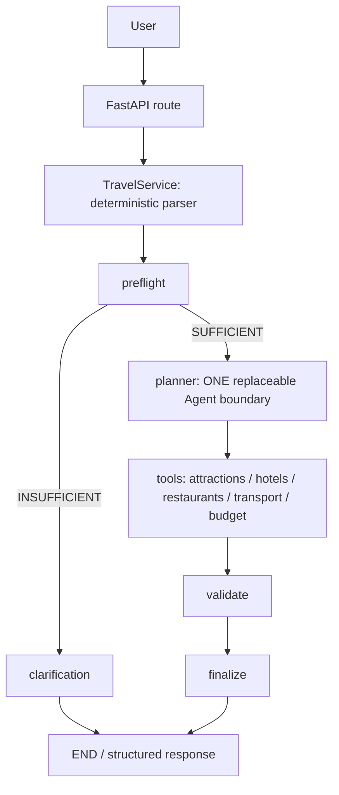

# Travel Agent

本项目包含本地基础设施、Single-Agent 架构及可选的 OpenAI planner 适配器。
默认使用离线 `DeterministicTestPlanner`；pytest 和环境检查不调用 OpenAI API。
真实模型接入尚待用户批准 live smoke，未验证线上兼容性；无 RAG 或真实旅游 API。
Phase E 已加入受控演示场景、响应驱动的 Demo takeaway 和澄清恢复入口，保留现有预算、行程及执行可视化。

## Local Demo — Phase E Controlled Scenarios

本轮提供请求输入、五个带演示目的说明的场景、API 集成、需求提取展示、
后端执行历史、工具输入/结果卡片、planner 与 validation 摘要，以及默认折叠的工程诊断。
阶段按后端数组顺序展示，selected 与 executed 分开显示；超预算不改变执行成功状态。
预算展示团体/每人口径、预算上限、剩余或超支、分类成本；行程展示每一天的活动、
类别、活动金额、日总额和行程总额。所有官方金额直接来自后端，不在前端重新合计。
response、budget 和 itinerary 的警告在 Estimate limitations 中保留原文并去重。
没有结果时，根据澄清路径或工具执行记录说明原因；未提供预算不会被显示为零预算。

前端只负责输入与展示，需求提取、planner、工具、验证、预算比较和行程生成均由后端负责。
当前 Demo 使用 `DeterministicTestPlanner` 和本地 mock 旅游数据，不需要 OpenAI Key。
首次 `npm install` 需要 npm 包访问；依赖安装完成后，本地 deterministic 运行不需要 OpenAI
或外部旅游 API。前端不使用 CDN 字体、脚本或其他远程页面资源。

### Start the backend

先完成下方已有 Python/`.venv` 安装步骤，并保留有效的项目 `.env` 配置。
Settings 仍要求 PostgreSQL 配置字段，但此规划路径不连接 PostgreSQL、Redis 或 Chroma，
所以演示本身无需启动 Docker 服务。不要覆盖已有 `.env`。

在项目根目录的 PowerShell 中执行：

```powershell
# 仅设置当前终端/子进程，不修改 .env，也不会调用 OpenAI。
$env:AGENT_PLANNER = 'deterministic'
$env:OPENAI_API_KEY = ''
$env:OPENAI_MODEL = ''
$env:LANGSMITH_TRACING = 'false'
$env:LANGCHAIN_TRACING_V2 = 'false'
.\.venv\Scripts\python.exe -m uvicorn app.main:app --app-dir backend --host 127.0.0.1 --port 8000
```

后端地址：<http://127.0.0.1:8000>。健康检查：<http://127.0.0.1:8000/health>。
OpenAPI：<http://127.0.0.1:8000/openapi.json>。

### Start the frontend

使用 Node.js 24 LTS（前端工具与内置 TypeScript 测试要求 Node >=22.18）。
在另一个从项目根目录打开的终端中执行：

```powershell
cd frontend
npm install
npm run dev
```

Windows PowerShell 若限制 `npm.ps1`，使用 `npm.cmd install` / `npm.cmd run dev`，
无需修改系统执行策略。

打开 <http://127.0.0.1:5173/>。Vite 固定使用 5173，端口占用时直接报错。
`frontend/vite.config.ts` 将相对 `/api` 请求代理到 `http://127.0.0.1:8000`，
不需要修改 FastAPI CORS。修改后端端口时同步修改此代理配置，并重启 Vite。

前端唯一规划请求为 `POST /api/v1/travel/plan`，JSON body 仅包含 `query`。
未获得响应时显示 Mode unconfirmed；之后使用后端 execution 元数据确认模式及 planner
是否被调用。Live 模式没有前端开关，也不是本轮依赖。

### Presets and expected behavior

预设仅填入文本，不自动提交。点击 Plan Trip 后，输入与预设按钮暂时禁用，只显示统一
Running 状态，不伪造实时阶段进度。修改文本、切换预设或 Reset 会清除旧结果。

| Preset | Expected result |
|---|---|
| Boston | success，USD 223；预算 USD 500；剩余 USD 277 |
| NYC | success，USD 494；预算 USD 1000；剩余 USD 506 |
| Clarification | needs_clarification，缺 destination/duration；planner 未调用 |
| Tight Budget | success，USD 446；预算 USD 50；剩余 USD -396；OVER BUDGET |
| Atlantis | error；四个搜索 NO RESULTS，预算 SKIPPED，验证未执行，finalization 完成 |

Atlantis 预设 `Plan a 2-day trip to Atlantis.` 可验证 HTTP 200 的领域错误；
`Plan a 0-day trip to Boston.` 可验证 HTTP 422。HTTP 错误与领域错误分别显示。
网络失败显示连接提示，非 JSON 错误正文不会作为 HTML 或堆栈展示。
澄清后请编辑并重新提交完整请求，后端不会合并历史对话。

### Frontend verification and contracts

```powershell
cd frontend
npm run typecheck
npm test
npm run build
```

`build` 先运行 `vue-tsc --noEmit`，再进行 Vite 构建。测试使用 Node 内置 test runner，
没有增加 Vitest/Jest 等测试框架。唯一运行时依赖为 Vue；开发依赖为 Vite、官方 Vue
编译插件、TypeScript 和 vue-tsc。版本固定并提交 `package-lock.json`；后续可用 `npm ci`。
没有单独配置前端 lint 工具。

Phase E 的 41 项前端测试包含现有 API/请求状态回归，以及使用已安装 Vue server renderer
和 Vite 编译组件的语义渲染测试。`frontend/tests/fixtures/plans.json` 保存五个预设的本地
deterministic 响应；测试读取静态样例，不启动后端、不调用模型或外部服务。

额外手工验证场景（无需添加预设）：

* `Plan a 2-day trip to Boston for 2 travelers under $500 per person.`：团体 USD 446，
  每人比较成本 USD 223，每人剩余 USD 277。
* `Plan a 2-day trip to Boston.`：每人估算 USD 223，无预算上限。
* `Plan a 2-day trip to Boston under $500 total.`：人数未知，团体预算比较不可用。

手工 TypeScript 接口位于 `frontend/src/types/travel.ts`，已对照当前 `app.openapi()`。
OpenAPI 默认字段保留 optional 标记，可空值保留 `| null`；`breakdown` 不假定所有键必定出现。
未来后端契约变化时同步检查接口和客户端测试。客户端进行基本响应 envelope 检查，
没有引入完整的运行时 schema 校验库。`execution` 可以为 null。

预算状态仅映射后端 `within_budget` 的 true/false/null；比较成本和剩余金额直接显示后端值。
日期只显示后端提取值，不在前端计算时长。工具状态、是否执行以及验证状态均来自 execution。

`npm run build` 生成 `frontend/dist/`；本阶段只配置开发代理，构建产物尚未接入生产静态托管。
不要用 `file://` 打开 dist 并期待 `/api` 自动工作。运行演示请使用上述 Vite 开发服务器。
结束时分别在两个服务器终端按 Ctrl+C。

工具依据：[Vue TypeScript 文档](https://vuejs.org/guide/typescript/overview)、
[Vite 启动文档](https://vite.dev/guide/)。

本项目使用标准 CPython 3.11 x64 创建虚拟环境，不使用 Anaconda 作为 base。
此前 Anaconda 自带的旧 MSVC runtime 导致 Chroma 原生写入崩溃；解决方式是
隔离 Python 解释器，不修改 Anaconda、不复制 DLL，也不改变 DLL 搜索顺序。

## Prerequisites

- Git for Windows
- 标准 CPython 3.11 x64（本机安装为官方 CPython 3.11.9）
- Node.js 24 LTS + npm（预留给后续前端，本阶段无需 npm install）
- Docker Desktop，使用 WSL 2 后端和 Linux containers
- PowerShell；localhost 的 5432、6379、8000 端口可用

先打开 Docker Desktop，等待 Engine running。可用 `docker info` 检查。
若安装后已有终端找不到命令，关闭该终端窗口再重新打开。

## First-time Setup

克隆或复制项目后，进入包含本 README 的 `agent-project` 根目录。
以下命令适用于 Windows PowerShell。先明确标准 CPython 安装位置，不能依赖
未激活虚拟环境时的 `python`：它可能仍然指向 Anaconda。
示例使用官方安装器的默认当前用户路径；若安装在其他位置，请调整 `$cpython`。

```powershell
$cpython = Join-Path $env:LOCALAPPDATA 'Programs\Python\Python311\python.exe'
& $cpython --version
& $cpython -m venv .venv
.\.venv\Scripts\Activate.ps1
python -c "import sys; print(sys.executable); print(sys.base_prefix)"
python -m pip install -r requirements.txt
Copy-Item .env.example .env
docker compose config --quiet
docker compose up -d --wait --wait-timeout 120
docker compose ps
python scripts/check_environment.py
pytest
ruff check .
python -m uvicorn app.main:app --app-dir backend --reload --host 127.0.0.1 --port 8000
```

仅在 `.env` 尚不存在时执行复制，避免覆盖已有配置。
仅在 `.venv` 内升级构建工具（可选，初始化时已执行）：

```powershell
python -m pip install --upgrade pip setuptools wheel
python -m pip --version
where.exe python
```

确认 `sys.executable` 位于项目 `.venv`，`sys.base_prefix` 位于标准 CPython 安装目录。
本机 CPython 采用当前用户安装，未加入 PATH，也未安装 Python Launcher。
CPython 3.11.9 是 3.11 系列最后提供传统官方 Windows 安装器的版本；后续 3.11
安全版本只提供源码，不应将 3.11.9 理解为最新安全补丁版。
虚拟环境不能直接跨电脑复制；移动项目后，重新创建 `.venv` 并安装 requirements。
项目源码与配置不依赖用户目录绝对路径。

### Dependencies

`requirements.txt` 是唯一依赖版本来源，锁定本次验证的直接和传递依赖，
目标平台为 Windows x64 / Python 3.11。包含运行依赖及 pytest、pytest-asyncio、Ruff。
保留 `uvicorn[standard]` 与 `psycopg[binary]` extras。
`pyproject.toml` 管理元数据、Python 版本、pytest 和 Ruff；动态读取同一 requirements，
不维护第二套版本。日常无需 `pip install -e .`。

升级依赖时应在项目 `.venv` 内有意识地升级并通过所有检查，再更新锁定文件；
不要每次启动开发环境都升级。Chroma 的传递依赖可能包括 NumPy、ONNX Runtime
和 tokenizers；不额外安装 PyTorch、TensorFlow、transformers 或模型。

### Environment Variables

`.env.example` 是公开示例，`.env` 是本地配置且被 Git 忽略。
`OPENAI_API_KEY` 在本阶段保持空值，不需要 Key 即可运行全部验收。
不要将真实凭据加入源码或 README。

`Settings` 使用 pydantic-settings，从项目根目录 `.env` 加载；普通系统环境变量
优先于文件。密码和 Key 使用 `SecretStr`，模块 import 不发起网络访问。
smoke test 显式使用空 OpenAI Key，不检查机器上其他位置的 Key。
Chroma 的相对路径始终相对于项目根目录，切换当前目录不会改变数据位置。

`POSTGRES_PASSWORD=change_me` 仅为本地示例，请按需在 `.env` 修改。
PostgreSQL 已有数据卷时，修改 `.env` 不会自动更改数据库中的密码。
不要通过删除数据卷解决已有数据的密码问题。

`APP_HOST`、`APP_PORT` 可由 Settings 读取；Uvicorn 命令行参数控制实际监听地址，
修改这两个设置时也要调整启动命令。`/health` 仅检查进程，不访问配置、数据库或 Redis。

## Infrastructure and Checks

Compose 只运行 PostgreSQL 16 和 Redis 7，端口仅绑定 `127.0.0.1`。
PostgreSQL 使用 named volume `postgres_data`，不创建业务表。
Redis 当前为临时测试基础设施，不保证重建容器后数据保留，不配置应用缓存。
Chroma 直接在 Windows 上使用 `PersistentClient`，数据保存在 `chroma_data/`。

```powershell
docker compose config --quiet
docker compose up -d --wait --wait-timeout 120
docker compose ps
python scripts/check_environment.py
```

`config --quiet` 验证完整 Compose 配置但不打印展开后的数据库密码。
若服务不健康，停止下一步并查看 `docker compose logs --tail 100 postgres redis`。
若端口占用，可修改 `.env` 的 PostgreSQL/Redis 端口后重新启动。

smoke test 验证 Python 3.11、项目虚拟环境、配置、三个框架 import、PostgreSQL
`SELECT 1`、Redis PING/SET/GET/DEL、Chroma collection CRUD 和向量查询。
Chroma 使用固定手工向量，禁用 embedding function 和匿名遥测。
临时 Redis key 带过期时间并在 finally 中删除；Chroma 临时 collection 同样在
finally 中清理，不修改已有 collection。任何失败都返回非零退出码。
错误仅输出异常类型，避免日志泄露连接凭据。

成功标志为 `ENVIRONMENT CHECK PASSED`。

## Daily Development

1. 打开 Docker Desktop，等待 Engine running。
2. 在项目根目录打开 PowerShell，执行：

```powershell
.\.venv\Scripts\Activate.ps1
docker compose up -d --wait --wait-timeout 120
python -m uvicorn app.main:app --app-dir backend --reload --host 127.0.0.1 --port 8000
```

访问 <http://127.0.0.1:8000/health>，应返回 HTTP 200：

```json
{"status": "ok", "service": "travel-agent-backend"}
```

也可在 `backend` 目录执行 `python -m uvicorn app.main:app --reload`。
不需要修改系统 `PYTHONPATH`。

在另一个新 PowerShell 的项目根目录执行质量和环境检查：

```powershell
.\.venv\Scripts\Activate.ps1
python scripts/check_environment.py
pytest
ruff check .
docker compose ps
git status --short
git check-ignore .env
```

## Shutdown

在运行 Uvicorn 的终端按 Ctrl+C，然后：

```powershell
docker compose down
deactivate
```

`docker compose down` 保留 PostgreSQL named volume。
不要默认使用 `docker compose down -v`：`-v` 会删除数据库数据。
本项目未配置远程仓库或 push。Phase 4 基线已按授权提交（`8a72a5f`）。

## Architecture — Phase 4

**ONE Agent boundary, MULTIPLE tools.** 只有 `planner` 是 LLM 决策节点。
默认实现是固定规则测试替身，不是生产级 AI Agent；不存在 HotelAgent、FoodAgent
或其他子 Agent。LangGraph 中其余节点全部为确定性代码。



| Layer | Responsibility |
|---|---|
| `agent/requirements.py` | Pydantic requirements、受限英语规则解析、preflight |
| `agent/planner.py` | `PlannerProtocol`、`PlannerDecision` 和离线 planner；唯一决策入口 |
| `agent/openai_planner.py` | 可选 OpenAI Responses 结构化输出适配器 |
| `agent/state.py` | `TravelState`，结构化状态与 messages 分开 |
| `tools/contracts.py` | 明确的 Pydantic 搜索/预算输入、统一 `ToolResult` |
| `tools/mock.py` | 四类本地 JSON 查询，Decimal 预算算术 |
| `agent/itinerary.py` | mock 行程组合、日序及费用一致性校验 |
| `agent/graph.py` | LangGraph 节点、条件路由、工具错误处理 |
| `agent/extractor.py` | 可替换的需求提取协议及默认规则实现 |
| `agent/service.py` | 通过 extractor 提取需求、运行 graph、映射响应 |
| `api/travel.py` | HTTP 输入验证及调用 service，无 planner/tool 业务逻辑 |

`TravelState` 包含 messages、requirements、requirement_status、missing_fields、
tool_requests、tool_results、itinerary、budget_summary、warnings、errors 和
clarification_question。每次请求新建状态，无 checkpointer、对话记忆或持久会话。
工具结果保存在 tool_results，不塞入 messages；messages 不包含人工推理链。

`build_graph(planner=...)` 接受任何符合 `PlannerProtocol` 的实现。可替换模型适配器，
保留 graph 控制流。本阶段固定 mock slice 要求四类搜索后计算预算；尚未实现动态
LLM tool-calling 循环。预算参数在工具搜索后由确定性代码填入，再交给 budget tool。

### Requirements and Clarification

必需条件仅为 destination，以及 duration_days 或完整 start_date + end_date。
日期范围包含起止两日；显式 duration 与日期冲突返回 HTTP 422。
未提供人数时 `travelers=null`，未提供预算时 `budget_amount=null`；不补出 3 天、2 人或 $1000。
当前有界演示支持 1–30 天、明确提供时 1–20 位旅客。

解析器只用于离线验证，支持例如 `to Boston`、`to NYC`、`3-day`、`3 days`、
`2 travelers`、`under $1000`、`budget USD 1000`、ISO 日期，以及文档内示例偏好词。
它不是通用自然语言理解器；复杂句式、否定、其他语言和未识别偏好不能被可靠解释。
起点会记录，但不查询跨城交通。未知目的地保留原值，由 tools 返回 NO_RESULTS。

缺字段走 `clarification -> END`，不调用 planner 或任何旅游 tools。
无匹配数据、工具异常、预算/行程不一致返回 `status=error` 和可读错误，
不伪造 success。此状态补充原设计中的 success / needs_clarification。

### Mock Tools and Cost Semantics

`data/mock/` 中四个文件各 6 条固定数据，覆盖 New York City 和 Boston。
所有名称、价格和报价单位都是测试素材，不代表真实商家、价格、营业时间或路线。
搜索采用目的地、max_price 和严格偏好标签过滤，按价格及稳定 ID 排序；
偏好无法同时满足时返回 NO_RESULTS，不自动改成其他偏好。

所有工具使用 `ToolResult(tool_name, status, data, source, error, metadata)`。
状态为 SUCCESS、NO_RESULTS、ERROR；搜索 source 为 mock，预算为 deterministic。
搜索输入统一为 `SearchInput`，预算使用 `BudgetInput` / `CostItem`，
不接收无约束字典来猜字段。

费用规则明确标记为 mock 报价约定：每天一个景点、三餐、每日交通费，
住宿为天数减一晚。每条 fixture 价格按人报价，不隐含房间分配。
小数据集可能重复景点或餐厅，会提示。税、服务费、跨城交通和实时可用性不在报价内。
constraints 仅记录并警告未核验，不宣称满足无障碍或其他约束。

- 人数已给出：返回 group 总价；人数未知：返回 per_traveler 单位参考费用。
- `budget_scope=TOTAL_TRIP` 仅在人数组及币种明确时比较整团费用；
  `PER_PERSON` 比较每人费用，无需推断人数；`UNKNOWN` 不比较，within_budget 为 null。
- mock 报价固定 USD；演示中 `$` 按 USD 解析。EUR/GBP 预算保留原币种，
  不做汇率换算或直接与 USD 比较。
- 四类费用通过 Decimal 确定性求和，再验证每日活动、每日总价及总预算一致。

Phase 4 route 不使用 PostgreSQL、Redis 或 ChromaDB。
`check_environment.py` 仍是独立的 Phase 3 基础设施检查，不是 RAG 或业务存储。
默认离线执行没有 OpenAI/付费 API、远程模型下载、LangSmith tracing 或云配置。

### API Examples

启动后，在另一个 PowerShell 执行：

```powershell
$request = @{query = 'Plan a 3-day trip to New York City under $1000. I like museums and food.'}
Invoke-RestMethod -Uri 'http://127.0.0.1:8000/api/v1/travel/plan' `
  -Method Post -ContentType 'application/json' -Body ($request | ConvertTo-Json)

$request = @{query = 'Plan a trip for me.'}
Invoke-RestMethod -Uri 'http://127.0.0.1:8000/api/v1/travel/plan' `
  -Method Post -ContentType 'application/json' -Body ($request | ConvertTo-Json)
```

完整请求返回 success、requirements、structured itinerary、budget 和 warnings。
缺信息请求返回 needs_clarification、missing_fields、clarification_question，
itinerary/budget 为 null。空 query、非法数字或冲突日期返回 HTTP 422。
`GET /health` 保持原有返回格式。无 streaming、WebSocket 或认证。

### Tests and Evaluation Seed

```powershell
pytest
ruff check .
python scripts/check_environment.py
```

`backend/tests/agent/` 的测试阻止 Internet DNS/连接尝试（仅允许本机事件循环需要的
loopback socket），并在被测代码吞掉连接异常时仍判定失败。
业务测试不依赖数据库服务、随机输入或真实 LLM。预算、失败状态、澄清不调用工具、
planner 替换、跨请求状态隔离及真实 FastAPI TestClient 路由均有覆盖。

`evals/datasets/travel_smoke_v1.json` 已扩展为 18 个案例：正常请求、缺目的地、缺时长、
日期、预算范围、多人、偏好、未知目的地、故障及困难约束。字段包括 input、expected_requirement_fields、
expected_status（preflight）、expected_api_status、required_tools、forbidden_tools、
budget_constraint。pytest 会实际执行这些案例；不包含 expected_reasoning 或人工 CoT。

已知上游 Starlette/AnyIO 的一条弃用警告不影响测试，未为屏蔽它变更锁定依赖。

## Phase 5 — Planner Configuration and Offline Gate

保持 `.env` 中 `AGENT_PLANNER=deterministic`（也是代码默认值）。新增配置见
`.env.example`：`OPENAI_MODEL=`、`PLANNER_PROMPT_VERSION=planner_v1`。
无需 key 即可运行全部离线测试。API 通过配置工厂创建 planner；图只依赖协议。
`TravelService()` / `build_graph()` 的直接调用仍默认离线，显式注入可替换实现。
切换 `.env` 后重启后端，使缓存 service 重新加载配置。

只有获得 live 调用批准后才填写 `.env` 的 `OPENAI_API_KEY`、`OPENAI_MODEL`，并按需
选择 `AGENT_PLANNER=openai`。缺少 key 或 model 时，API 在创建 service 的第一个请求
返回清晰 HTTP 503；不会调用模型，也不会回退成假成功。`/health` 仅表示进程存活。
模型名没有源码默认值。未联网查询模型可用性或价格，须在 live 批准时确定模型。

OpenAI adapter 使用已锁定的 `openai` SDK Responses `parse(text_format=PlannerDecision)`，
不更换依赖。一次 planner 执行最多一次请求，30 秒网络超时，零自动重试，
当前输出上限 1024 tokens、reasoning effort=low，`store=False`。固定官方 API 地址，不读取自定义代理/base URL。
无 LangChain 模型 callback/tracing；传入模型的是结构化 requirements，而非 API Key
或原始用户消息。未请求、存储或评价完整思维链。

模型仅输出 `can_proceed`、`tool_requests`、简短 `warnings`。schema 禁止额外字段，
工具参数使用 Pydantic 严格验证；未知工具、重复工具、错目的地及模型编造的预算输入
均拒绝执行。现有 mock slice 仍需四类搜索和一次预算工具，不引入动态工具调用循环。
预算参数只能在搜索完成后由确定性代码生成。模型警告保留，但不是事实或正确性证明。
无效/空/拒绝/不完整响应、认证、限流、超时进入 `status=error`；错误只含安全分类，
不会回显 provider 响应或 key。可重试错误仅标记，本阶段不自动重试。

预算字段从 `budget` 调整为 `budget_amount` + `budget_scope`。受限英语解析器仅识别
紧跟金额的 `total` / `for the whole trip`、`per person` / `per traveler` / `each`；
没有明确范围就保持 `UNKNOWN`，即使人数已给出。例：`under $50 total`。
TRAVEL-004 已补充 `total`，其余未明确范围的案例不声称预算已满足。

```powershell
python scripts/check_environment.py
pytest
ruff check .
python scripts/evaluate_planners.py
```

评估脚本默认只跑 deterministic。固定四例 TRAVEL-001/002/004/005，结果写入被忽略的
`evals/results/*.jsonl`，包括 planner/model/prompt、需求状态、工具验证、预算、最终状态、
延迟和安全错误。拒绝的原始模型输出不会写入日志；无法获知其中非法工具名称时记录
`invalid_tools=null`，而非宣称没有非法工具。当前不记录 token usage。

**以下命令必须等用户明确批准 model、最多 3 次付费请求并配置 key 后才能运行：**

```powershell
python scripts/evaluate_planners.py --live --approved-model '<approved-model>'
```

该命令先跑相同四例的 deterministic 基线，再跑 OpenAI；澄清例不调用模型，因此
最多 3 次 provider 请求。任一错误立即停止本轮，不自动重试。批准模型必须与
`OPENAI_MODEL` 完全一致。此命令不代表已执行 live 验证，不应加入默认 pytest/CI。

## Phase 5A — Offline Hardening

本阶段不批准 live 调用，不配置 Key 或 billing。默认保持 deterministic。
`RequirementsExtractorProtocol.extract(query)` 将需求提取从 service 中隔离；默认
`RuleBasedRequirementsExtractor` 包装原有规则解析器，没有实现 LLM extractor。
可通过 `TravelService(extractor=...)` 注入替代实现，不需要更改 graph。
规则解析器仍有已知的句式及否定理解限制；困难约束只记录并提示未核验，不宣称满足。

planner 接收 requirements 深拷贝，修改会导致 error；图中的原始需求保持不变。
模型决定再次经 schema 验证，搜索不得改目的地或丢弃明确偏好。返回的 ToolResult
也会重新验证，禁止 ERROR 携带成功数据。预算结果必须与本地 deterministic calculator
完全一致（包括来源、范围和比较结果）；失败不会产生 itinerary 或 budget_summary。
没有 `verified_facts` 字段，planner warnings 不作为事实验证证据。

`TravelService.run()` 返回内部 state 和 `ExecutionTrace`；普通 `plan()` / HTTP 响应
不包含 trace。trace 只含 run_id、planner_type、prompt_version、requirement_status、
selected_tools、tool_statuses、validation_status、final_status、latency_ms。
不包含原始 query、模型响应、Key、CoT 或自由文本错误；不使用 LangSmith。
澄清未进入 validation 时标记 not_reached，错误路径 failed，通过路径 passed。

运行完整离线评估：

```powershell
python evals/evaluate_travel.py
```

此入口无 live 模式，显式创建 deterministic planner，运行全部 18 个案例。
TRAVEL-013 使用仅限评估的本地工具故障注入，不暴露到 HTTP 输入或模型工具名单。
预期 error/needs_clarification 也是合法案例结果，按预先写好的 expectation 判分。

指标定义：

- Case pass rate：需求字段、preflight/最终状态、工具、预算、预期 warning 全部匹配的比例。
- Requirement accuracy：数据集显式指定的 expected_requirement_fields 匹配数 / 检查数。
- Required tool hit rate：要求执行的工具中实际执行过的比例；不等于工具成功率。
- Forbidden tool violations：禁止执行的工具实际被执行的次数（按每案例唯一工具计数）。
- Final status accuracy：最终状态与 expected_api_status 一致的案例比例。

结果写到被 Git 忽略的 `evals/results/baseline-*.json`，包含指标分子/分母、逐例判分
和结构化 trace。planner=deterministic，dataset=travel_smoke_v1，prompt_version=N/A。
这是固定 mock 数据集的回归分数，不能证明通用自然语言理解或真实 LLM 效果。
指标测试包含故意篡改需求、工具、状态、预算和 warning 的负例，避免只验证全绿路径。

## Phase 5B — Requirements Understanding Baseline

Current input language: **English**（有限规则支持）。中文仅作为未来能力评估样本，
未实现中文解析。Real LLM not yet enabled；无 LLMRequirementsExtractor、网络或付费调用。
这不是通用自然语言理解器。

本轮保持 `RequirementsExtractorProtocol` 和 schema 不变。增加的是有限通用规则：
空白及弯引号归一化、one–twenty 数字词、常见明确人数表达、带货币符号/币种的金额、
`total budget is`、前置否定词的局部作用范围。人数不从 `we` 推断，cheap/affordable
不映射美元数值，冲突事实只提取、不解决。`around` 金额附加 approximate budget 约束。

正向偏好仍进入 interests / 各类 preferences；识别的否定和 must 要求进入现有
constraints，例如 `avoid museums`、`no meat`、`no rental car`、`must stay near downtown`。
这不表示工具已经验证或强制满足约束；mock itinerary 仍提示 constraints 未核验。
行为迁移：`no walking` 不再产生正向 walking 偏好；旧 TRAVEL-015 的错误预期已更正。
无 JSON schema 字段迁移，偏好/约束列表比较忽略顺序。

**日期支持**：仅显式 `YYYY-MM-DD` 单日期/起止日期，起止均给出时按包含两端计算天数；
不猜缺失年份，不支持月份名称、斜杠日期、相对日期或 long weekend 的精确时长。
识别到 `New York or Boston` 或 `somewhere warm` 时不选城市，继续要求 clarification。
其他复杂歧义仍可能误提取，详见已知失败。

独立提取评估与 planner/tool smoke 分离：

```powershell
python evals/evaluate_requirements.py
python evals/evaluate_requirements.py --strict
```

`requirements_eval_v1.json` 固定 44 例，28 core + 16 robustness（其中 3 例中文）。
数据集在规则改进前固定，并记录 SHA-256；没有根据 robustness 失败逐例追加修复。
robustness 是预先标记的保留评估集，不宣称是独立第三方盲测。
执行顺序严格为 query → real extractor → compare expected；不调用 planner 或 tools。
ID、split、expected_fields 不传给 extractor。

默认命令完成报告就返回 0，**不代表所有案例通过**。`--strict` 有任一失败即返回 1；
当前确实返回 1，11 个能力失败未跳过或 xfail。pytest 测试的是实现承诺和评估器正确性，
独立能力集衡量更广泛的未支持表达，二者分开报告。

结果含 full-case exact match、逐字段正确率、各字段组准确率、core/robustness 分数、
确定性 failure taxonomy、期望/实际差异。所有指标带分子分母；空值也是有效预期。
另外提供 nonempty_target_metrics，防止空字段占比掩盖能力缺口。比如当前日期组总体
42/44 正确，但实际要求提取日期的案例仅 1/3 正确。没有目标时指标为 null（N/A）。

可读的前后对比和完整失败列表见 [requirements baseline](evals/requirements_baseline.md)。
详细运行报告写入已忽略的 `evals/results/requirements-*.json`，不包含 CoT。

当前重要限制：`skip`、后置否定、`not only`、`dislike` 等不能可靠解释；嵌套介词
可能污染目的地（例如 `to spend a long weekend in Boston`）；月份/斜杠/缺年日期及
中文未支持。金额和人数规则也不是完整语义解析，不应把通过 core 当作生产能力。

## Phase 5C-Prep — Controlled Planner A/B Harness

Phase 5B baseline commit: `e249ec3`。本轮冻结 rules、requirements 数据集、`planner_v1`
以及 mock 数据；只准备评估设施，不批准真实 API 请求，不需要 billing 或真实 Key。

`planner_live_smoke_v1.json` 有 8 个稳定案例：normal NYC、normal Boston、museum、
vegetarian、低整团预算、按人预算、多个兴趣、酒店无匹配。每例有手工核对的完整需求
快照及 golden contract（必需/可选/禁止执行工具、目的地、偏好、预算和最终状态）。
无 expected_tool_order、CoT 或已知解析失败案例。

每次运行先执行真正的 RuleBasedRequirementsExtractor，逐例对照冻结快照并检查
preflight sufficient；不同即拒绝实验。随后 A/B 使用快照的独立深拷贝，运行同一 graph、
tools、mock fixtures、budget calculator、validator、finalizer。默认 A 是 deterministic，
B 才是 OpenAIPlanner。Golden 工具匹配按集合，不比较搜索顺序；当前产品仍是四次搜索
后一次预算计算的固定 mock slice，没有放宽到任意工具循环。

```powershell
# 默认 dry-run，选前 3 例；即使环境配置 openai 也不会创建 provider client
python evals/evaluate_planner_live.py
python evals/evaluate_planner_live.py --dry-run

# 完整 8 例离线模拟，SDK 使用内存 MockTransport；绝无真实 provider 请求
python evals/evaluate_planner_live.py --simulate --max-cases 8
```

Dry-run 显示数据集、所选 ID、extractor/planner、模型配置状态及未来请求上限；
本轮实发请求为 0。默认 `max_cases=3`，允许 1–8，超出硬上限或不足 1 立即拒绝。
不支持自动扩展到 44 例 requirements 数据集。

**以下入口仅供将来单独获批后使用，本阶段不要执行：**

```powershell
python evals/evaluate_planner_live.py --live --max-cases 3 --approved-model '<approved-model>'
```

真实模型只从 `OPENAI_MODEL` 读取，`--approved-model` 仅检查一致性、不选择模型。
`--live` 下缺 Key、缺模型或模型不一致即 fail fast，无 deterministic fallback。
先跑 A，A 任一 case 未符合 golden 则不创建 B；B 出现未符合 golden 的结果即停止，
不自动重试。SDK `max_retries=0`、timeout=30 秒；Phase 5C 输出上限降至 1024、effort=low，每例一次请求。
代码 guard 不代替用户批准。旧四例 `scripts/evaluate_planners.py` 保留为 Phase 5 兼容入口；
受控 A/B 实验统一使用本节的新入口，不混用两个入口计数。

### Metrics and provenance

实现 case success rate、required tool recall、forbidden tool violation rate、invalid tool rate、
invalid argument rate、duplicate tool rate、destination/preference preservation rate、
budget integrity rate、final status accuracy、factual provenance rate、mean latency。
指标带分子和分母。required recall 按实际执行的能力计数，不要求成功工具的数量相同；
forbidden violation 按案例是否执行禁止工具计数。无匹配案例正确返回 error 也可通过 golden。
错误率按可观察到的 planner 决定计数；超时/认证等无法判断输出是否合法时为 null，
不冒充 0%。没有产出预算/最终事实的案例，其完整性指标为 N/A，不算作已验证。

Provenance check 对最终每个活动名称、报价、类别、目的地和币种关联到本轮搜索结果，
并核对日程总价；预算完整性再次与 deterministic calculator 比较。不新增业务数据源。
未知工具名统一记录 `<unregistered>`，只保存安全诊断分类，不持久化拒绝的原始输出。

Trace 预留并在 harness 填充 model、input_tokens、output_tokens、total_tokens、
api_latency_ms、api_error_type。没有可用 usage 就为 null；mock 不生成收费 token 统计。
观测数据以 ContextVar 隔离并逐请求重置。原始响应、Key、CoT 不写日志；LangSmith 被禁用。

每个记录携带 case_id、extractor、planner、model、prompt version、需求快照摘要、工具、
各类完整性、最终状态、延迟、用量及安全错误；运行同时记录 dataset version/hash、Git commit、
working-tree dirty 标记、代码/fixtures 摘要和 extractor 摘要。未提交代码不会被伪装成纯 commit。

结果在被忽略的 `evals/results/planner-mock-*.json` 或将来的 `planner-live-*.json`。
模拟报告同时显示 `Deterministic`、`OpenAI MOCK` 与 **`OpenAI: NOT RUN`**，不能用模拟分数
推断真实模型效果或价格。当前尚未联网确定模型、可用性或价格。

Phase 5C 首轮限定 LIVE-001/002/003。输出预算通过 `OPENAI_MAX_OUTPUT_TOKENS` 配置，
reasoning 使用 `OPENAI_REASONING_EFFORT=low`；未修改 `planner_v1` 或冻结的解析/工具层。
quota、billing、authentication、model access、permission 错误应归为 live infrastructure
blocked，不作为 planner 能力失败，不切模型、不自动重试。模型只在 `.env` 配置。

# Recruiter Demo Script

当前演示是 single-agent 有界规划系统：规则提取需求、验证工具契约、使用 deterministic
planner 和 mock 旅游数据，并公开结构化执行记录。它不提供生产预订、实时旅游搜索、
多智能体协作或会话记忆；现场演示无需 OpenAI。可选模型适配器不代表已验证的 live demo。

## 60–90 seconds

1. **Boston，20 秒**：选择后点击 Plan Trip。依次指出结构化需求、工具编排、验证、
   USD 223 的预算与两日行程；每次选择只填文本，不自动运行。
2. **NYC，10 秒**：展示 museums 和 vegetarian 需求及工具输入，说明偏好如何传递。
3. **Clarification，15 秒**：缺目的地和时长，planner 未调用。点击 Load complete Boston
   example，再手动提交，展示完整新请求如何恢复成功；系统不记忆前一次请求。
4. **Tight Budget，15 秒**：执行成功、验证通过，同时明确超预算 USD 396。
5. **Atlantis，15 秒**：搜索无结果、预算跳过、验证未执行，无虚构行程。

## 30 seconds

Boston（10 秒）→ Clarification（10 秒）→ Atlantis（10 秒）：展示完整成功路径、
必填输入保护和受控失败。需要继续演示时用 Try another scenario 返回选择器。
Reset 清除草稿、场景身份、已提交请求、响应、错误和 takeaway。

## Interview talking points

* 单智能体有界图让工具顺序和终止条件可检验，适合明确范围的旅行规划演示。
* 公开执行记录解释系统实际做了什么，不暴露或伪造隐藏推理。
* 工具契约验证约束输入与输出结构，前端不复制规划规则。
* selected 与 executed 分离，能解释批准后未运行的预算工具。
* 确定性 mock 演示便于重复验证；run ID、延迟变化不影响领域结果。
* 执行成功与预算满足分开表达，避免掩盖业务约束违规。

## Distinct failure and guardrail states

| State | Meaning |
|---|---|
| needs_clarification | 输入不完整；需重新提交完整请求，不是系统故障 |
| Domain error | HTTP 200 带领域错误，保留真实执行记录，例如 Atlantis |
| HTTP error | 服务拒绝或无法处理请求，例如 422；无可展示执行记录 |
| Network error | 无法取得响应；不虚构运行阶段 |
| Over-budget success | 规划执行成功，但后端预算比较超限，行程仍可返回 |

场景说明仅表达演示目的。实际数值和 Demo takeaway 均由响应决定；自定义请求仍使用
同一个 POST /api/v1/travel/plan。所有场景都没有额外后端端点或失败注入。
