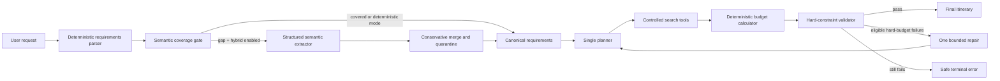
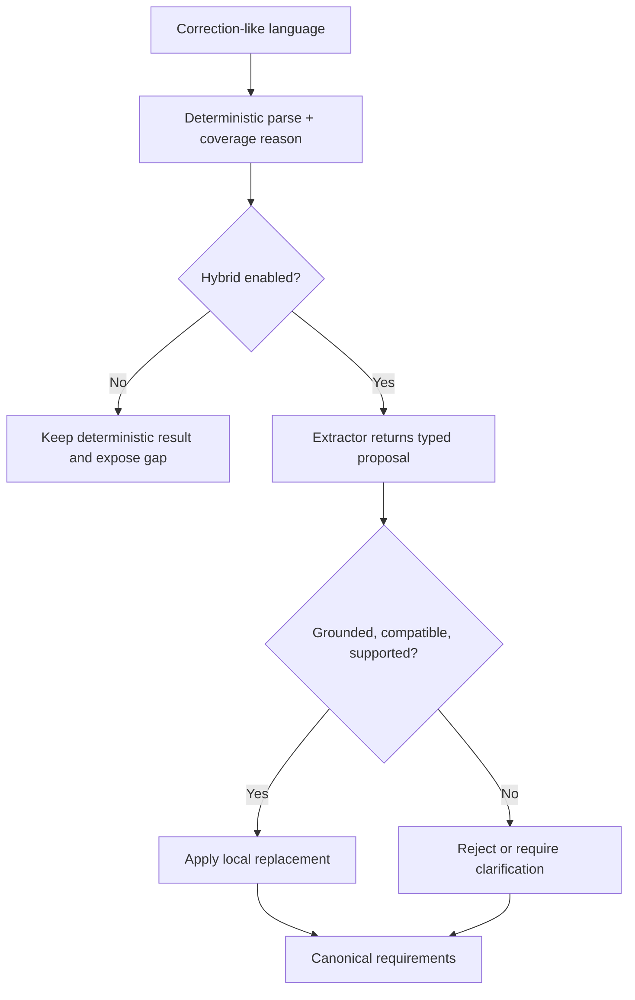

# Travel Planning Agent

A safety-first single-agent travel planner that turns a natural-language request into explicit requirements, retrieves controlled candidates, validates hard budgets, and performs at most one structured repair before returning a result.

The primary portfolio demo is deterministic, local, and API-key-free. An optional hybrid mode uses an LLM only for semantic gaps; model output is treated as an untrusted proposal and cannot silently override deterministic facts.

## 1. Why this project exists

Travel requests mix facts, preferences, hard limits, corrections, and vague tradeoffs. A fluent plan is not useful if it quietly changes “must stay under $350” into a suggestion. This project explores a practical agent pattern: keep critical constraints typed and deterministic, use model assistance selectively, and make every important decision inspectable.

## 2. What it demonstrates

- Natural-language extraction for destination, duration, travelers, dates, budgets, and preferences.
- Typed total-trip and hotel-total hard constraints with provenance.
- A deterministic semantic coverage gate over a 200-case robustness suite.
- Optional structured semantic extraction and conservative merge quarantine.
- Planner-directed retrieval across real snapshot attractions, hotels, food, and modeled transport.
- Transparent selected candidates, preserved alternatives, planner estimates, tags, and preference matches.
- Deterministic budget calculation and hard-constraint validation.
- One typed feedback-driven repair attempt—never an unbounded retry loop.
- Safe clarification and terminal failure without fabricated itineraries.

## 3. Execution modes

| Mode | Default | Network/model dependency | Purpose |
|---|---:|---|---|
| Deterministic semantic mode | Yes | None | Reproducible parser, gate, planner, tools, validation, and repair demo |
| Hybrid semantic mode | No | OpenAI API key and model | Calls the extractor only when the coverage gate detects a semantic gap |
| Deterministic planner | Yes | None | Stable recruiter walkthrough and regression tests |
| OpenAI planner | No | OpenAI API key and model | Optional planner adapter; not required by the primary demo |

The UI reads the backend’s execution record and labels the actual mode. It never pretends that an optional-live request used a model when the server is deterministic.

## 4. Architecture



The backend is FastAPI plus a LangGraph state machine. The frontend is Vue 3 with Vite. In recruiter-demo mode, attractions, hotels, and restaurants come from checked-in OpenStreetMap snapshots covering 12 U.S. cities. Candidate retrieval is offline; costs are deterministic planner estimates rather than live commercial prices. Transport remains an intentionally synthetic planning allowance.

## 5. Correction safety



The extractor does not plan, calculate costs, choose candidates, validate budgets, or recommend repairs. Corrections are local: a replacement must have a compatible nearby target. Conflicts, unsupported scopes, and unresolved references stay visible instead of being guessed.

## 6. Recruiter demo workflow

The UI presents five stages in order:

1. User Request
2. Requirements Understanding
3. Candidate Retrieval / Selection
4. Validation
5. Repair / Final Result

Start with **Real Snapshot Trip** to show offline real-world POIs, then use **Bounded Budget Repair**. The Austin scenario produces an initial USD 394 plan, a typed USD 44 hard-budget violation, one lower-cost repair, a final USD 317 plan, and passing revalidation. See [the exact script](docs/RECRUITER_DEMO_SCRIPT.md).

## 7. Recruiter demo

Prerequisites: standard CPython 3.11 x64, Node.js 22.18+ (Node 24 LTS recommended), npm, and Windows PowerShell. Docker Desktop is optional: the included Postgres and Redis services are future scaffolding and are not called by the deterministic planning demo.

From a fresh clone, install dependencies and select the explicit real-snapshot configuration:

```powershell
git clone <repository-url>
cd travel-planning-agent
Copy-Item .env.demo.example .env
py -3.11 -m venv .venv
.\.venv\Scripts\python.exe -m pip install -r requirements.txt
cd frontend
npm.cmd ci
cd ..
.\.venv\Scripts\python.exe scripts\preflight_recruiter_demo.py
```

Preflight eagerly validates the final migration manifest and all 36 declared snapshot routes. It performs no provider-network request. A missing/corrupt snapshot or invalid demo mode exits nonzero with a concise error.

Start the deterministic backend in the first terminal:

```powershell
.\.venv\Scripts\python.exe -m uvicorn app.main:app --app-dir backend --host 127.0.0.1 --port 8000
```

In a second terminal:

```powershell
cd frontend
npm.cmd run dev
```

Open <http://127.0.0.1:5173>. Health check: <http://127.0.0.1:8000/health>. OpenAPI: <http://127.0.0.1:8000/openapi.json>.

The primary demo is deterministic and API-key-free. `.env.demo.example` explicitly sets `CANDIDATE_DATA_MODE=snapshot` and points `CANDIDATE_SNAPSHOT_PATH` at the final OpenStreetMap migration manifest. The safe application default in `.env.example` remains `mock`.

Optional Docker scaffolding can be started with `docker compose up -d` and inspected with `docker compose ps`; skip it for the planning demo. For optional hybrid semantic extraction, set `OPENAI_API_KEY`, `OPENAI_MODEL`, and `SEMANTIC_AUGMENTATION_MODE=hybrid` before starting the backend. Keep `SEMANTIC_EXTRACTOR_PROMPT_VERSION=semantic_extractor_v3`. Never commit `.env`.

Recommended preset order: **Real Snapshot Trip** → **Bounded Budget Repair** → **Preference Matching** → one optional-live semantic boundary. Real POIs are frozen OSM snapshot facts, candidate costs are planner estimates, and transport is synthetic. None of the first three scenarios requires internet access.

## 8. Demo presets

| Preset | Dependency | Story |
|---|---|---|
| Real Snapshot Trip | Offline | Boston real-world snapshot POIs and deterministic validation |
| Bounded Budget Repair | Offline | Austin hard-budget failure → one repair → deterministic revalidation |
| Preference Matching | Offline | Two hard budgets plus zoo and fried-chicken preferences in Columbus |
| Ambiguity Boundary | Optional live | An unscoped hotel amount remains clarification-bound |
| Correction Safety | Optional live | Extractor v3 proposes a local hotel-budget correction for conservative merge |
| Tradeoff Boundary | Optional live | A conditional hotel/location tradeoff is not flattened into false certainty |

Presets fill the request; they do not auto-submit. Every run is independent—there is no hidden conversation memory.

## 9. Evaluation evidence

These are frozen artifact results, not claims recomputed in the browser:

| Evaluation | Result | Artifact |
|---|---:|---|
| 200-case coverage-gate recall | 94.9% | [`phase_m2_coverage_delta.md`](evals/results/phase_m2_coverage_delta.md) |
| 200-case coverage-gate precision | 100% | [`phase_m2_coverage_delta.md`](evals/results/phase_m2_coverage_delta.md) |
| Extractor v3 clear-correction proposal recall | 100% | [`hybrid_semantics_live_m6.md`](evals/results/hybrid_semantics_live_m6.md) |
| Accepted clear corrections | 87.5% | [`hybrid_semantics_live_m6.md`](evals/results/hybrid_semantics_live_m6.md) |
| Live hard-safety violations | 0 | [`hybrid_semantics_live_m6.md`](evals/results/hybrid_semantics_live_m6.md) |
| Phase O frozen backend baseline | 631 passed, 3 expected xfailed | [`REAL_DATA_BATCH_MIGRATION_REPORT.md`](docs/REAL_DATA_BATCH_MIGRATION_REPORT.md) |
| Current recruiter checkpoint | 633 backend passed, 3 expected xfailed; 55 frontend passed | [`PROJECT_STATUS_FINAL.md`](docs/PROJECT_STATUS_FINAL.md) |

The M6 experiment is bounded evidence, not a claim of general language understanding. Its report also documents misses and merge false accepts/rejects.

## 10. Verification

```powershell
.\.venv\Scripts\python.exe -m pytest -q
.\.venv\Scripts\python.exe -m ruff check .
.\.venv\Scripts\python.exe scripts\preflight_recruiter_demo.py
cd frontend
npm.cmd test
npm.cmd run build
```

Frontend tests use Node’s built-in test runner and Vue server rendering; no extra test framework was added. The production build runs TypeScript checking first.

## 11. Current limitations

- English-only bounded request patterns; this is not general conversational memory.
- Frozen OpenStreetMap POI snapshots for Boston, New York City, Columbus, Chicago, Washington DC, Miami, Austin, Denver, Seattle, San Francisco, Los Angeles, and Las Vegas.
- No live prices, booking, maps, opening hours, routing, or availability.
- Only total-trip and hotel-total hard budget scopes execute. Unsupported scopes are retained for clarification.
- Ratings and review counts are display metadata, not universal ranking factors.
- Hybrid results depend on the configured model and provider availability; use deterministic mode for the primary demo.
- Exactly one eligible budget repair is allowed. Failure after that attempt is terminal and explicit.

## 12. Repository map

```text
backend/app/agent/       parsing, coverage, merge, graph, planner, validation, public trace
backend/app/tools/       typed tools, controlled candidate access, budget calculation
backend/tests/           unit, integration, safety, scenario, and evaluation tests
frontend/src/            Vue recruiter demo and API client
data/travel/us/          controlled planner IDs, estimates, units, and preference tags
data/travel/snapshots/   frozen OpenStreetMap runtime snapshots and manifest
evals/datasets/          frozen semantic datasets and live subsets
evals/results/           machine-readable and human-readable evaluation artifacts
docs/                    architecture, testing history, demo script, and final status
```

Start with [Recruiter Demo Handoff](docs/RECRUITER_DEMO_HANDOFF.md), [Current Project Status](docs/PROJECT_STATUS_FINAL.md), [Recruiter Demo Script](docs/RECRUITER_DEMO_SCRIPT.md), and [Interview Talking Points](docs/INTERVIEW_TALKING_POINTS.md).
