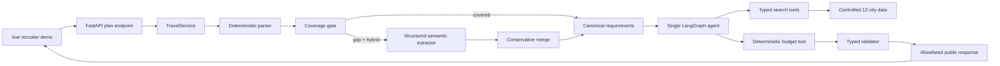
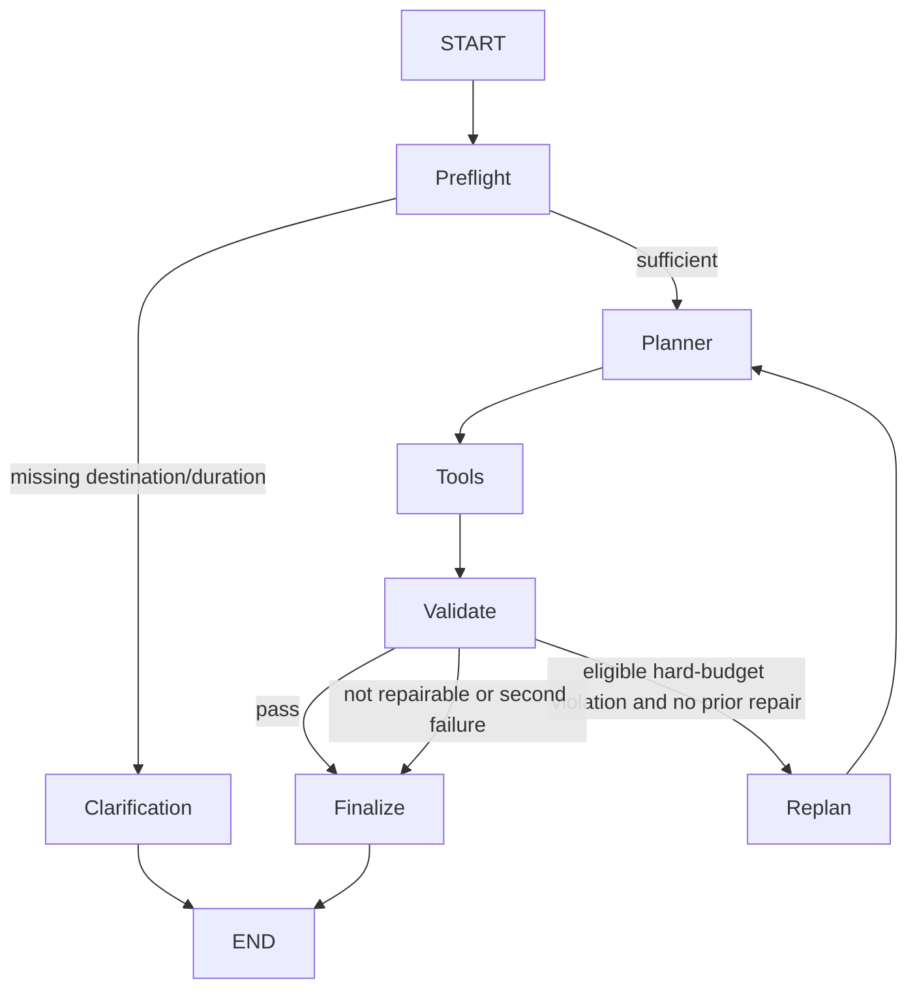
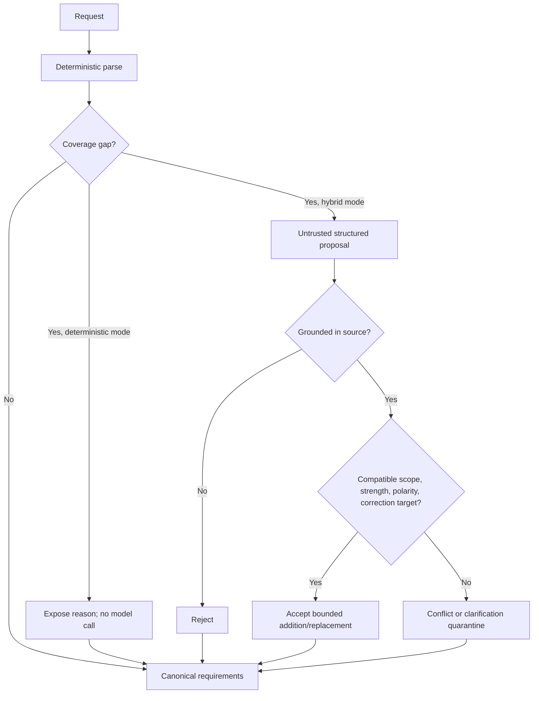
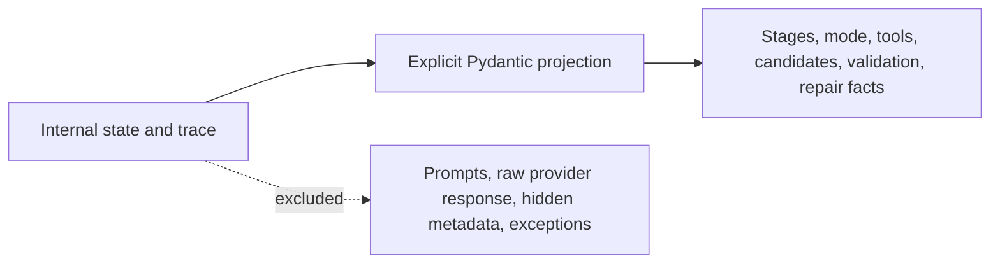
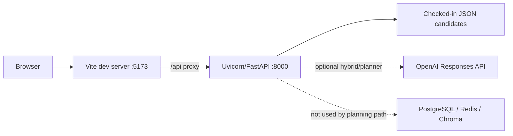

# Final Architecture Diagrams

These diagrams describe the connected request path. PostgreSQL, Redis, Chroma, RAG, booking, and live travel providers are not part of that path.

## System view

## Runtime state machine

`Replan` carries typed violations and the prior itinerary. The routing condition caps it at one attempt.

## Semantic safety boundary

The model has no authority to calculate costs, select candidates, validate constraints, or decide repair eligibility.

## Public observability boundary

The UI receives completed facts, not hidden reasoning or fabricated live progress.

## Deployment status

The primary demo uses only Browser → Vite → FastAPI → checked-in data. It does not require Docker or an API key.
