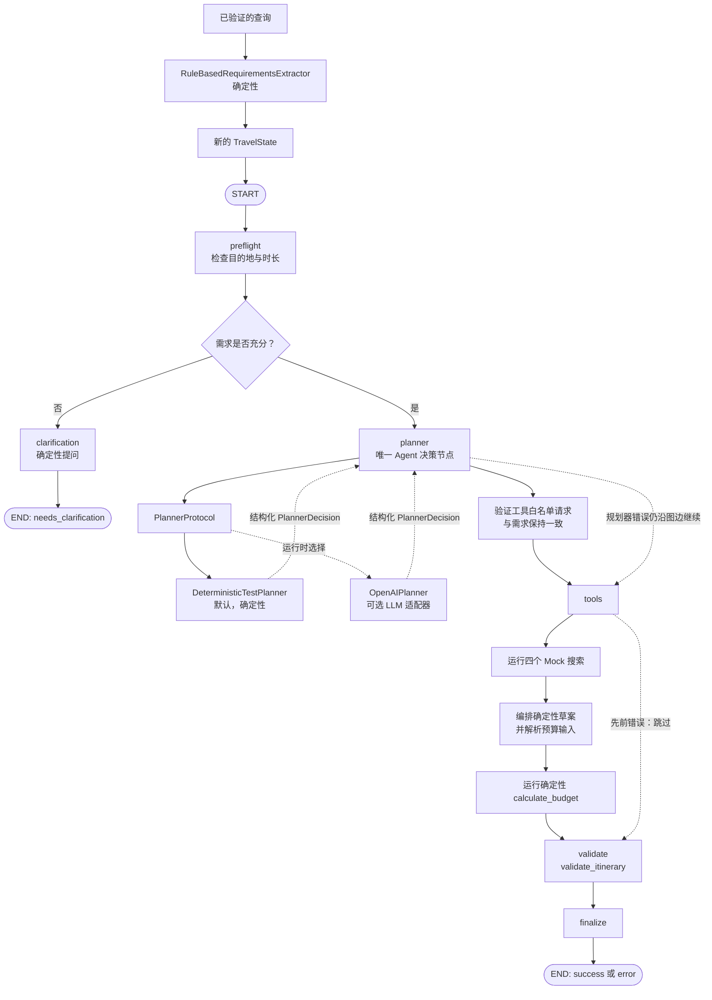
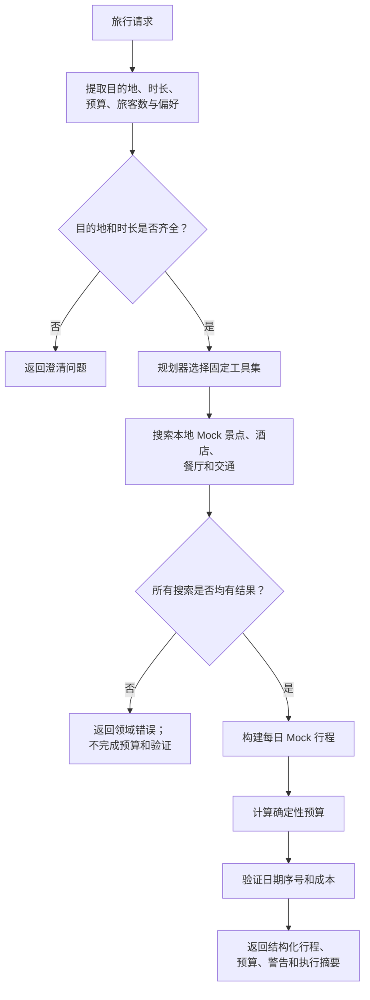
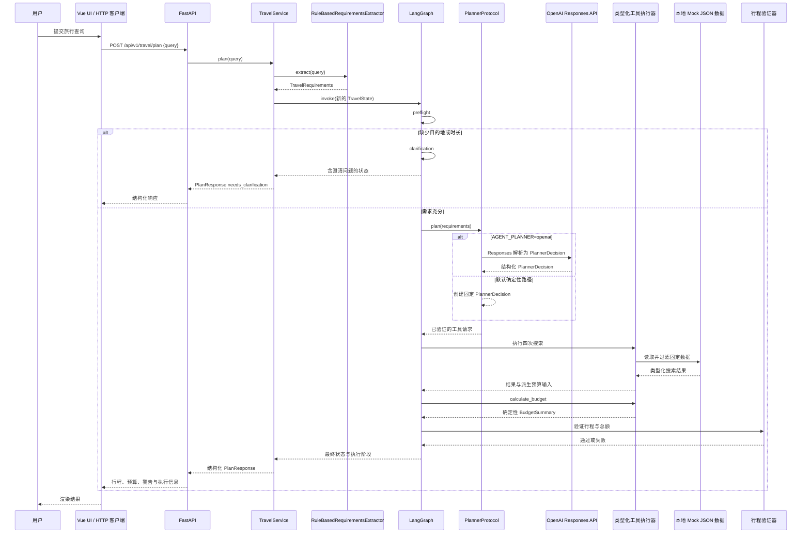

# Travel Planning Agent — 架构图

本文描述仓库当前的本地原型架构，并以仓库证据为依据：仅在源代码将组件接入常规旅行规划请求路径时，才将其表述为该路径的一部分；已具备开发条件或仅供未来使用的组件不会被误画为当前运行能力。

## 1. 架构状态图例

| 标记 | 含义 |
|---|---|
| `[已实现 / 已接入]` | 代码已存在，并参与当前请求执行路径。 |
| `[已实现 / 可选]` | 代码已存在且可在运行时选择，但不是默认演示路径。 |
| `[仅基础设施]` | 本地基础设施或验证工具已存在，但旅行规划请求路径并不使用它。 |
| `[占位]` | 目录、接口或部分结构已存在，但能力尚未完整实现。 |
| `[已规划 / 尚未实现]` | 未发现实现；仅作为明确标注的未来边界展示。 |
| `[无法确认]` | 仓库未提供足够可靠的证据以作进一步判断。 |

## 2. 仓库证据摘要

| 组件 | 状态 | 主要证据 |
|---|---|---|
| FastAPI 健康检查与旅行规划 API | `[已实现 / 已接入]` | `backend/app/main.py`, `backend/app/api/travel.py` |
| Vue 旅行规划界面与 Vite 开发代理 | `[已实现 / 已接入]` | `frontend/src/App.vue`, `frontend/src/api/travelApi.ts`, `frontend/vite.config.ts` |
| 单一 Agent（Single Agent）LangGraph 编排 | `[已实现 / 已接入]` | `backend/app/agent/graph.py` |
| 基于规则的需求提取 | `[已实现 / 已接入]` | `backend/app/agent/extractor.py`, `backend/app/agent/requirements.py` |
| 确定性规划器 | `[已实现 / 已接入]` | `backend/app/agent/planner.py`, `backend/app/agent/service.py` |
| OpenAI Responses 规划器 | `[已实现 / 可选]` | `backend/app/agent/openai_planner.py`, `.env.example` |
| Mock 搜索工具与确定性预算计算 | `[已实现 / 已接入]` | `backend/app/tools/mock.py`, `backend/app/tools/candidate_data.py`, `data/travel/us/cities.json` |
| 行程编排与结构/预算验证 | `[已实现 / 已接入]` | `backend/app/agent/itinerary.py`, `backend/app/agent/graph.py` |
| PostgreSQL 与 Redis 本地服务 | `[仅基础设施]` | `docker-compose.yml`, `scripts/check_environment.py` |
| Chroma 本地持久化与健康验证 | `[仅基础设施]` | `backend/app/core/config.py`, `scripts/check_environment.py`, `chroma_data/` |
| 旅行知识 RAG | `[已规划 / 尚未实现]` | `backend/app/rag/__init__.py` 为空；未发现摄取、检索器或图/工具集成 |
| 应用业务 schema / 迁移 | `[已规划 / 尚未实现]` | `backend/app/db/__init__.py` 为空；未发现模型、迁移或仓储代码 |
| 评估工具链 | `[已实现]` | `evals/evaluate_travel.py`, `evals/evaluate_requirements.py`, `evals/evaluate_planner_live.py` |

## 3. 系统架构总览

```mermaid
flowchart TB
    User[用户]
    Browser[Vue 3 旅行规划界面<br/>[已实现 / 已接入]]
    API[FastAPI POST /api/v1/travel/plan<br/>[已实现 / 已接入]]
    Service[TravelService<br/>[已实现 / 已接入]]
    Extractor[RuleBasedRequirementsExtractor<br/>[已实现 / 已接入]]

    subgraph Runtime[单一 Agent 运行时]
        Graph[LangGraph TravelState 图<br/>[已实现 / 已接入]]
        Planner[PlannerProtocol — 唯一规划器边界]
        DefaultPlanner[DeterministicTestPlanner<br/>默认演示]
        OptionalPlanner[OpenAIPlanner<br/>[已实现 / 可选]]
        Validation[行程与预算验证<br/>[已实现 / 已接入]]
    end

    subgraph ToolLayer[类型化工具层]
        Attractions[search_attractions]
        Hotels[search_hotels]
        Restaurants[search_restaurants]
        Transport[search_transport]
        Budget[calculate_budget]
    end

    MockData[data/travel/us/cities.json 统一固定数据<br/>[已实现 / 已接入]]
    Response[结构化 PlanResponse 与执行摘要]
    OpenAI[OpenAI Responses API<br/>外部服务；可选]

    subgraph PreparedInfra[不在请求路径中的本地基础设施]
        Postgres[PostgreSQL 16<br/>[仅基础设施]]
        Redis[Redis 7<br/>[仅基础设施]]
        Chroma[Chroma 持久化目录<br/>[仅基础设施]]
    end

    User --> Browser --> API --> Service
    Service --> Extractor --> Graph
    Graph --> Planner
    Planner --> DefaultPlanner
    Planner -. AGENT_PLANNER=openai .-> OptionalPlanner --> OpenAI
    Graph --> Attractions & Hotels & Restaurants & Transport & Budget
    Attractions & Hotels & Restaurants & Transport --> MockData
    Budget --> Validation --> Response --> Browser
    API -. 请求路径不使用 .-> Postgres
    API -. 请求路径不使用 .-> Redis
    API -. 请求路径不使用 .-> Chroma
```

### 图表说明

请求可从 Vue 开发界面或任意 HTTP 客户端进入，经过 FastAPI 后交由 `TravelService` 处理。服务先提取需求，再调用一个 LangGraph `TravelState` 图。唯一的 Agent/规划决策边界是 `PlannerProtocol`；景点、酒店、餐厅、交通与预算能力均为类型化工具，而非独立 Agent。

### 当前实现状态

默认已接入路径完全本地运行：`RuleBasedRequirementsExtractor`、`DeterministicTestPlanner`、四个 Mock JSON 搜索、确定性预算计算与行程验证。配置 `AGENT_PLANNER=openai` 且具备所需 OpenAI 配置时，`OpenAIPlanner` 可作为同一协议的运行时可选实现。Vue 前端已实现，并使用 Vite 的 `/api` 开发代理。

### 当前限制

默认工具数据是本地确定性固定数据，而非实时旅行信息。`TravelService` 和图不会调用 PostgreSQL、Redis 或 Chroma。该图并未声称具备生产部署、真实预订、实时可用性或前端静态托管能力。

## 4. Agent 编排流程



### 图表说明

`build_graph()` 定义了实际节点顺序：`preflight`，条件路由到 `clarification` 或 `planner`，之后依次为 `tools`、`validate` 和 `finalize`。目的地或时长缺失时，会在调用规划器或任何旅行工具之前，经由 clarification 结束。对于需求充分的请求，规划器返回受约束的 `PlannerDecision`，不暴露隐藏推理。

### 当前实现状态

除可选的提供商调用外，所有图节点均为确定性 Python 代码。图会验证规划器的结构化决策，强制固定的五工具白名单，防止需求被修改，运行四次搜索，根据结果派生预算输入，并验证完成后的行程。执行阶段会投影到公开响应中；内部执行轨迹不会作为 `PlanResponse` 返回。

### 当前限制

这是单一 Agent 图，不是多 Agent 系统。当前切片要求恰好四次搜索和一次预算计算；未实现开放式 LLM 工具调用循环或自动重试。规划器失败仍会沿固定图边继续，以记录后续节点的跳过/失败结果；它无法产出经过验证的行程。

## 5. RAG 旅行知识检索流程

```mermaid
flowchart LR
    Knowledge[data/knowledge/<br/>仅包含 .gitkeep]
    Ingest[摄取流水线<br/>[已规划 / 尚未实现]]
    Retriever[嵌入与检索器<br/>[已规划 / 尚未实现]]
    KnowledgeTool[知识检索工具<br/>[已规划 / 尚未实现]]
    Runtime[TravelState 图<br/>[已实现 / 已接入]]

    Knowledge -. 未发现实现 .-> Ingest
    Ingest -. 未来边界 .-> Chroma[(chroma_data/<br/>[仅基础设施])]
    Chroma -. 未来边界 .-> Retriever -. 未注册 .-> KnowledgeTool -. 未接入 .-> Runtime

    Check[scripts/check_environment.py] --> Client[Chroma PersistentClient]
    Client --> Temp[临时 collection CRUD<br/>与固定向量查询]
    Temp --> Cleanup[清理]
    Client -. 仅本地持久化 .-> Chroma
```

### 图表说明

下方路径是当前真实存在的代码：`scripts/check_environment.py` 创建本地 `PersistentClient`，验证临时 collection 的 CRUD 与固定向量查询，随后清理。上方路径仅标示预期 RAG 边界；没有任何摄取、嵌入工作流、检索器或知识工具接入旅行规划图。

### 当前实现状态

Chroma 配置和本地持久化目录已存在。`data/knowledge/` 除 `.gitkeep` 外没有旅行语料，`backend/app/rag/` 只包含空的包初始化文件。`graph.py` 仅注册五个 Mock/预算工具，因此 Agent 无法从 Chroma 检索。

### 当前限制

当前仓库证据仅提供 Chroma 基础设施验证，而不是旅行知识 RAG 执行路径。没有已实现的摄取过程、嵌入模型、检索结果或由 RAG 支持的规划器行为。

## 6. 数据库 ER 模型

### 当前数据库状态

```mermaid
flowchart TB
    Postgres[(PostgreSQL 16 容器<br/>[仅基础设施])]
    Settings[PostgreSQL 连接设置]
    Health[scripts/check_environment.py<br/>SELECT 1]
    NoSchema[未发现应用业务表、ORM 模型、<br/>迁移或仓储代码<br/>[已规划 / 尚未实现]]
    Runtime[FastAPI / TravelService 请求路径]

    Settings --> Health --> Postgres
    Postgres --> NoSchema
    Runtime -. 不连接 .-> Postgres
```

### 图表说明

当前不存在应用 ER 图，因为未发现应用层数据库实体或关系。PostgreSQL 在 Docker Compose 中声明，并可由独立环境检查脚本验证，但旅行规划 API 不连接它。

### 当前实现状态

`backend/app/db/` 仅包含 `__init__.py`；未发现 SQLAlchemy 模型、SQL DDL、迁移、session、仓储或业务表使用。唯一观察到的 PostgreSQL 查询是 `scripts/check_environment.py` 中的 `SELECT 1` 连通性检查。

### 当前限制

本文不提供建议的 `Trip`、`Itinerary`、用户或历史 schema，因为仓库没有实现或充分指定它们，无法将其表示为有源码依据的设计。尤其是，计划按请求返回，不会持久化。

## 7. 旅行规划工作流



### 图表说明

这是业务层面的用户旅程，而非 LangGraph 的实现细节。它从用户旅行请求开始，以澄清、领域错误或结构化计划结束。固定规划器为每个需求充分的请求选择相同的能力集，偏好过滤则会影响 Mock 搜索结果。

### 当前实现状态

规则解析器提取一组有边界的英文模式。当前行程编排器每天使用一个景点、三餐、每日交通，以及天数减一晚的住宿。预算计算器内部使用 `Decimal`，支持已记录的整趟/每人比较规则，验证器检查每日及总成本的一致性。

### 当前限制

搜索只读取受控的 `data/travel/us/cities.json`；它不是实时酒店、餐厅、景点、路线、评论或预订 API。约束被记录为警告而不是得到验证。日期只用于确定时长；不支持的目的地返回 `UNSUPPORTED_CITY_DATA`，不会虚构替代选项。

## 8. 部署架构

```mermaid
flowchart TB
    subgraph Machine[开发或演示机器]
        Browser[浏览器]
        Vite[Vue 3 + Vite 开发服务器<br/>127.0.0.1:5173]
        Python[Python 3.11 虚拟环境]
        FastAPI[Uvicorn + FastAPI<br/>127.0.0.1:8000]
        Agent[LangGraph Agent 运行时]
        Fixtures[data/travel/us/cities.json 统一固定数据]
        ChromaDir[chroma_data 本地目录<br/>[仅基础设施]]
        Env[.env 本地配置<br/>不提交]
    end

    subgraph Docker[Docker Desktop]
        Postgres[(PostgreSQL 16<br/>127.0.0.1:5432<br/>[仅基础设施])]
        Redis[(Redis 7<br/>127.0.0.1:6379<br/>[仅基础设施])]
    end

    OpenAI[OpenAI Responses API<br/>外部服务；仅按需启用]
    Browser --> Vite
    Vite -- /api 开发代理 --> FastAPI
    Python --> FastAPI --> Agent
    Agent --> Fixtures
    Env --> FastAPI
    Agent -. AGENT_PLANNER=openai .-> OpenAI
    FastAPI -. 请求路径不使用 .-> Postgres
    FastAPI -. 请求路径不使用 .-> Redis
    FastAPI -. 请求路径不使用 .-> ChromaDir
```

### 图表说明

仓库中已提交的部署模型是本地开发/演示执行。Vite 在 5173 端口提供 Vue UI，并将 `/api` 代理到 8000 端口的 Uvicorn/FastAPI。Docker Compose 仅启动 PostgreSQL 和 Redis，且均绑定到 localhost。Chroma 持久化是本地文件系统目录，而不是 Compose 服务。

### 当前实现状态

设置会在构造时从项目 `.env` 加载，并支持环境变量覆盖。FastAPI 路由通过 `AGENT_PLANNER` 选择规划器；确定性规划器是默认实现。OpenAI 是外部服务，仅会由可选的 `OpenAIPlanner` 调用；常规演示路径不发起外部旅行或模型请求。

### 当前限制

仓库中没有云提供商、反向代理、容器化应用服务、Kubernetes 配置、已部署的静态前端或生产托管配置。Docker 中的 PostgreSQL 和 Redis 仅用于环境检查，不用于请求持久化、缓存或会话。

## 9. 用户交互时序



### 图表说明

该时序图代表一次完整的 API 交互。服务会为每个请求创建新的状态，因此澄清响应不会为下一次请求保留对话上下文。规划器输出仅表示为结构化 `PlannerDecision`，而不是隐藏推理。

### 当前实现状态

澄清分支会刻意避免调用规划器和工具。在需求充分的分支，`TravelService` 会在响应中公开安全的执行投影——阶段、已选择/已执行的工具、验证状态和元数据。Vue 客户端仅提交查询文本，并渲染返回的结构。

### 当前限制

可选 OpenAI 调用不是默认路径，也没有自动重试。时序图省略 PostgreSQL、Redis、Chroma、认证、用户账户和记忆，因为当前请求路径不使用它们。

## 10. 已实现能力与规划能力对照

| 能力 | 状态 | 证据 | 备注 |
|---|---|---|---|
| 单一 Agent / 唯一规划器边界 | `[已实现 / 已接入]` | `backend/app/agent/graph.py`, `backend/app/agent/planner.py` | 工具不是 Agent。 |
| LangGraph 编排 | `[已实现 / 已接入]` | `backend/app/agent/graph.py` | 具有条件澄清路径的固定图。 |
| 基于规则的需求提取 | `[已实现 / 已接入]` | `backend/app/agent/extractor.py` | 有边界的英语规则解析器，不是通用 NLU。 |
| Requirements Extractor 协议 | `[已实现]` | `backend/app/agent/extractor.py` | 仅存在基于规则的实现。 |
| 确定性规划器 | `[已实现 / 已接入]` | `backend/app/agent/planner.py` | 默认规划器。 |
| OpenAI 规划器 | `[已实现 / 可选]` | `backend/app/agent/openai_planner.py` | 需要显式配置 Key 与模型。 |
| 工具契约验证 | `[已实现 / 已接入]` | `backend/app/agent/planner.py`, `backend/app/tools/contracts.py` | 严格白名单与类型化 Pydantic 契约。 |
| 统一美国候选数据 | `[已实现 / 已接入]` | `data/travel/us/cities.json`, `backend/app/tools/candidate_data.py` | 含别名和四类候选的本地受控固定数据。 |
| 预算计算器 | `[已实现 / 已接入]` | `backend/app/tools/mock.py` | 基于 `Decimal` 的确定性计算。 |
| 行程生成与验证 | `[已实现 / 已接入]` | `backend/app/agent/itinerary.py` | Mock 编排与结构验证。 |
| 结构化执行轨迹投影 | `[已实现 / 已接入]` | `backend/app/agent/execution.py`, `backend/app/agent/service.py` | 安全的公开执行摘要；不是 Chain-of-Thought。 |
| 回归与需求评估 | `[已实现]` | `evals/evaluate_travel.py`, `evals/evaluate_requirements.py` | 本地评估脚本和数据集。 |
| OpenAI 实时规划器评估工具链 | `[已实现 / 可选]` | `evals/evaluate_planner_live.py` | 默认 dry run；实时模式需要单独批准和配置。 |
| PostgreSQL | `[仅基础设施]` | `docker-compose.yml`, `scripts/check_environment.py` | 无业务 schema 或运行时使用。 |
| Redis | `[仅基础设施]` | `docker-compose.yml`, `scripts/check_environment.py` | 无缓存、会话或运行时使用。 |
| ChromaDB | `[仅基础设施]` | `scripts/check_environment.py`, `backend/app/core/config.py` | 仅本地健康式验证。 |
| RAG 摄取 | `[已规划 / 尚未实现]` | `data/knowledge/.gitkeep`, `backend/app/rag/__init__.py` | 无摄取代码或语料。 |
| RAG 检索 | `[已规划 / 尚未实现]` | 未发现检索器或已注册的知识工具 | 未接入图。 |
| 真实旅行 API | `[已规划 / 尚未实现]` | `backend/app/tools/mock.py` | 工具读取 JSON，不调用提供商。 |
| Vue 前端 | `[已实现 / 已接入]` | `frontend/src/App.vue`, `frontend/src/api/travelApi.ts` | 通过 Vite 开发代理连接。 |
| 持久化旅行历史 | `[已规划 / 尚未实现]` | 未发现业务数据库/schema 代码 | 每个请求创建新状态。 |
| 对话记忆 | `[已规划 / 尚未实现]` | `TravelService.run()` 创建新状态 | 无图 checkpointer 或会话存储。 |
| 认证 | `[已规划 / 尚未实现]` | 未发现认证路由/中间件 | 不属于该演示。 |
| 云部署 | `[已规划 / 尚未实现]` | 未发现云/IaC 配置 | 仅本地演示拓扑。 |
| 多 Agent 协作 | `[已规划 / 尚未实现]` | `graph.py` 仅有一个规划器边界 | 明确不表示为多个 Agent。 |

## 11. 架构观察

- 该仓库提供了一个有边界、由 Mock 工具支持的单一 Agent 旅行规划原型，具备可观察的阶段和受控的失败模式。其最完整的已接入路径是确定性、离线的。
- `OpenAIPlanner` 是使用 Responses API 和结构化输出的真实适配器，但仓库包含的是评估工具链，而非已提交的成功实时运行产物。因此，所提供的关于 `gpt-5.6-luna` smoke test 成功的历史说法无法仅从仓库独立推导，本文不会将其视为已验证的运行结果。
- 基础设施就绪不能与应用集成混淆：PostgreSQL、Redis 与 Chroma 都可以在本地配置或验证，但它们有意不在旅行规划请求流程中。
- 前端已为本地 Vite 演示实现。仓库没有提供生产静态托管或云端后端部署的证据。
- 响应与评估代码有意不将内部推理暴露给外部。图表仅使用结构化决策、类型化工具请求/结果和执行摘要。
