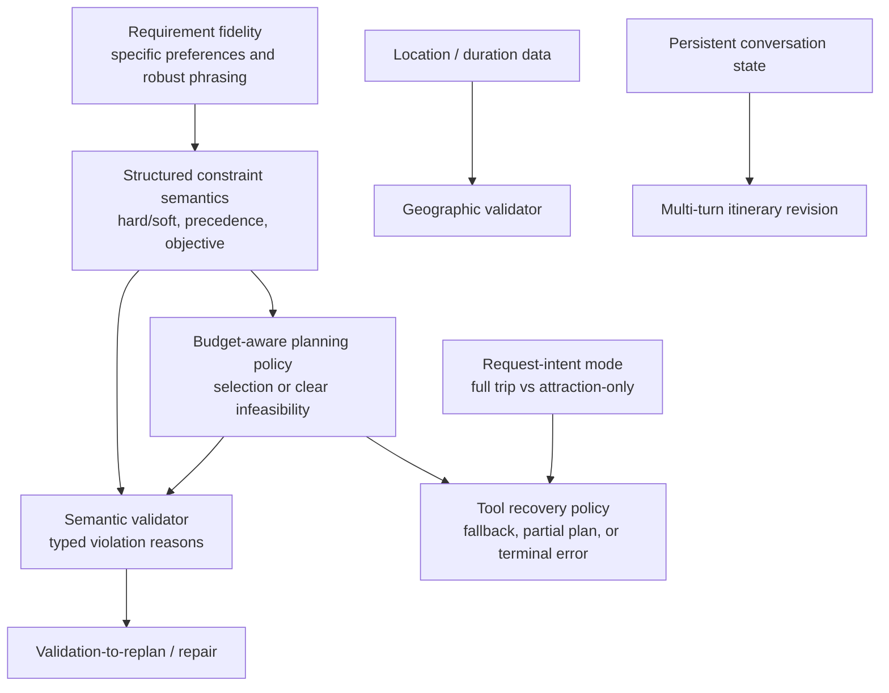

# Travel Planning Agent Capability Gap Prioritization Audit

## Scope and repository state

This is an evidence-based prioritization audit, not an implementation plan. It
reviews the current scenario suite, requirements evaluation, production request
path, architecture documentation, and existing tests. No production code or
tests were changed.

| Item | Value |
|---|---|
| Branch | `main` |
| HEAD | `08d922ed06e38cc53d803a056a1d3fab57c495a7` |
| Existing untracked work | `docs/architecture/`, the prior scenario-suite files, and this audit |
| Baseline evidence | 246 backend passed, 13 xfailed; 41 frontend passed |
| Default execution | Fully offline deterministic planner and local mock JSON data |

There is no HANDOFF document in the repository. The README and architecture
documents describe a deliberately bounded recruiter demo: a fresh state per
request, fixed four searches plus budget calculation, local data, and no
conversation memory, route data, or provider-backed recovery.

## Executive recommendation

The next phase should not start with replan, multi-turn memory, or geographic
optimization. Its highest-value work is a compact **requirement fidelity and
constraint semantics** slice:

1. Preserve specific preferences and reliably recognize supported English
   variants, including an explicit invalid/ambiguous-input outcome.
2. Represent budget strength, precedence, and optimization intent structurally
   rather than as free-text warnings.
3. Define and test the product policy for a hard budget: reject, clarify, or
   produce a clearly marked best-effort plan. Make the validator enforce that
   policy with structured reasons.

This sequence improves the recruiter demo's central claim—understanding and
executing user intent—without adding live services or redesigning the agent.
Automatic repair becomes credible only after these semantics exist.

## XFAIL inventory and clustering

The 13 xfails are three underlying capability families, not 13 unrelated
features. “Actual” below is verified from the implementation, not inferred
from an xfail name.

| XFAIL test | User behavior / expected semantic behavior | Actual behavior and reason | Capability family | Classification |
|---|---|---|---|---|
| `test_preserves_specific_food_preference_in_recruiter_golden_case` | `fried chicken` remains a food preference | Parser vocabulary only contains vegetarian, vegan, seafood; schema, state, planner and tool request would preserve a value if extracted | Requirement fidelity | Missing capability |
| `test_preserves_budget_utilization_objective_in_recruiter_golden_case` | Save “spend as much as reasonably possible” as an objective | No objective field in `TravelRequirements`, state, or `PlannerDecision`; deterministic planner does no optimization | Goal semantics | Architectural / missing capability |
| `test_invalid_textual_budget_is_not_silently_dropped` | `budget abc` is rejected or clarified | Monetary regex finds no number; preflight only requires destination/duration, so a plan can proceed without a budget | Requirement fidelity | Robustness gap |
| `test_transport_preferences_and_rental_car_avoidance_are_preserved_for_planner` | Preserve walking/transit and “avoid rental cars” | Walking/transit parse; singular-only negative regex misses plural `rental cars` | Requirement fidelity | Robustness gap |
| `test_preserves_halal_restriction_as_a_food_requirement` | Preserve/enforce halal food need | Halal is absent from parser vocabulary and mock tags; no dietary semantics exist | Requirement fidelity | Missing capability |
| `test_rejects_geographically_impossible_daily_schedule` | Detect implausible route/time schedule | Activity and mock option models have no coordinates or durations; validator only checks numbering and monetary totals | Geographic feasibility | Out of scope for current MVP / architectural gap |
| `test_validator_rejects_over_budget_plan_directly` | Treat hard-budget violation as validation failure | Calculator sets `within_budget=False`, but `validate_itinerary` never reads it and returns structural checks only | Constraint semantics | Missing capability |
| `test_validation_failure_triggers_a_second_planner_attempt` | Invalid plan receives a corrected second plan | Graph has a fixed forward-only `validate -> finalize` edge; no feedback object or replan route exists | Repair loop | Architectural gap |
| `test_multiturn_revision_preserves_unchanged_days` | Amend one day while retaining prior itinerary | API accepts only one query; service creates a new state every request; no checkpoint/history schema is connected | Conversation state | Out of scope for current MVP / architectural gap |
| `test_parser_accepts_equivalent_casual_trip_request` | Interpret `Boston, 3 days, just me, max 1k` like formal phrasing | Start-of-query city/duration work, but `just me` and `max 1k` are outside bounded grammar | Requirement fidelity | Robustness gap |
| `test_parser_ignores_irrelevant_context_and_extracts_trip_fields` | Ignore prose and extract mid-sentence shorthand trip details | Destination regex expects constrained `to/in/visit` grammar; `3-day Boston trip` is not reliably captured | Requirement fidelity | Robustness gap |
| `test_later_budget_constraint_overrides_earlier_statement` | Later `don't spend more than $700` overrides earlier $1,000 | Parser takes the first monetary regex match and immediately breaks; no precedence model | Constraint semantics | Robustness gap |
| `test_attraction_only_request_selects_no_unneeded_trip_tools` | Use only attractions for an attraction-only request | `PlannerDecision` and graph require exactly four searches plus budget; response model is full-trip-oriented | Request-mode/tool selection | Out of scope for current MVP / architectural gap |

### Related non-xfail evidence

- Tool exceptions and `NO_RESULTS` are safely exposed as errors, but any failed
  required search aborts draft and budget composition. There is no fallback,
  partial-itinerary, or retry policy. This is a **missing recovery capability**,
  not an unexpected failure.
- The requirements evaluation independently reports unresolved date forms,
  negation errors, a missed hotel-dislike constraint, and unsupported Chinese
  probes. These reinforce the requirement-fidelity cluster; they do not create
  a separate planning architecture problem.
- Current “hard vs soft budget” behavior is only partial. `around` appends the
  free-text constraint `approximate budget`; all other budget strength and
  precedence semantics are implicit or absent.

## Root-cause trace

### Specific preferences and dietary restrictions

```text
User text
  -> parse_requirements: fixed vocabulary rejects fried chicken / halal
  -> TravelRequirements: list[str] can carry a value, but receives none
  -> TravelState / JSON validation: would preserve a populated field
  -> DeterministicTestPlanner: would pass food_preferences to restaurant search
  -> mock._search: exact tag-subset filter; fixtures also lack those tags
  -> final plan: cannot demonstrate the preference
```

The loss is at extraction, with a second data-contract consequence. It is not a
state-copy or planner-drop bug: graph code explicitly rejects planner decisions
that drop extracted preferences. Supporting a preference end-to-end therefore
requires an extraction policy and matching controlled fixture/tag semantics;
simply adding a parser phrase would likely turn into `NO_RESULTS`.

### Budgets, objectives, validation, and replan

```text
User text
  -> parser: budget amount/scope; only 'around' gets a free-text approximation
  -> TravelRequirements: no hard/soft strength, precedence, or objective field
  -> planner: always selects fixed tools and supplies no price/utility strategy
  -> calculator: correctly computes comparison_cost and within_budget
  -> validate_itinerary: checks totals, not within_budget or constraints
  -> graph: validate always flows forward to finalize; no feedback/replan edge
```

This is not a calculator accuracy defect. The calculator already distinguishes
total-trip/per-person scope and uses Decimal arithmetic. The missing product
decision is what `within_budget=False` means for a hard constraint. Until that
policy is represented and validated, replan would have no reliable goal or
failure reason to act upon.

### Recovery, routing, geography, and conversation

The graph treats every search as mandatory and returns as soon as any search has
an `ERROR` or `NO_RESULTS`; budget and validation are then skipped. The strict
five-tool contract prevents targeted request modes. Geographic data is absent
from `TravelOption`, `Activity`, and the mock fixtures. `TravelService.run()`
creates fresh `TravelState` and the route body has only `query`; PostgreSQL,
Redis, and Chroma are infrastructure-only. These are deliberate bounds of the
current controlled demo, not isolated parser fixes.

## Dependency graph



`RF` is a prerequisite for making claims about user-intent fidelity. `CS`, `PD`,
and `SV` are the prerequisite chain for credible replan. Tool recovery has a
separate policy decision, while geography and multi-turn state require new data
models and should not block the first recruiter-MVP improvement.

## Ranked development sequence

| Priority | Capability family | Why now | Dependencies / completion evidence |
|---|---|---|---|
| P0.1 | Requirement fidelity | Highest visible recruiter value: it proves that a user’s concrete request survives parsing and reaches the selected tool. It is local, deterministic, and already has xfail/eval evidence. | Define supported preference taxonomy and invalid/ambiguous-input outcome; expand controlled tags/fixtures together; turn selected xfails and requirements-eval cases green. |
| P0.2 | Structured constraint semantics and hard-budget policy | A plan that labels hard user constraints as a warning undermines semantic correctness. The calculator already supplies the raw comparison fact, so this has a high leverage-to-scope ratio. | Add explicit strength/precedence/objective representations and choose terminal policy: reject, clarify, or visibly best-effort. Tests must differentiate this policy from soft preferences. |
| P0.3 | Semantic validator with structured reasons | Converts existing budget facts into an enforceable contract and creates useful public explanation. It is necessary before attempting repair. | Validator must receive typed requirements/policy and produce stable reason codes; over-budget xfail becomes a policy-aligned assertion. |
| P1.1 | Budget-aware repair/replan | Valuable agent behavior only after P0 establishes what must be repaired. Current fixed planner cannot choose cheaper options or accept feedback. | P0.2–P0.3, planner strategy capable of alternative selections, bounded attempt budget, and deterministic invalid-first-plan test. |
| P1.2 | Tool recovery policy | Current fail-closed behavior is safe and demonstrable; improving it can add resilience, but needs a product choice about partial results versus clarification versus terminal error. | Request-mode/output policy, tool-error taxonomy, and fixtures for fallback outcomes. |
| P2 | Intent-specific tool selection | Useful for a broader product, but the demo intentionally models a complete trip and enforces the fixed tool set. | Intent classifier and a response contract for non-itinerary answers. |
| P2 | Geographic feasibility | Requires dependable location/travel-time data and changes the mock model substantially. High complexity with low incremental value for the current local demo. | Coordinates/durations, route source or controlled distance fixture, itinerary timing model, geo validator. |
| Defer | Multi-turn revision | Meaningful, but needs durable trip identity, state/history, conflict handling, and revised response/API contracts. The current recruiter story explicitly states statelessness. | Persistence/checkpointer, session/trip model, modification semantics, revision tests. |

## What not to prioritize next

- Do not add an automatic retry before there is a semantic failure reason and a
  planner action that can actually improve the plan. That would create a loop
  without a defined repair target.
- Do not add route optimization or real-time travel providers solely to make the
  geographic xfail pass. The current value proposition is deterministic,
  inspectable behavior, and these additions would change it materially.
- Do not add memory just to make a single multi-turn xfail green. It requires a
  product-level trip/session contract absent from this application.
- Do not treat every parser phrase as independent work. Extend the requirement
  capability dataset by semantic family and define the supported language
  boundary before broadening rules or swapping extractors.

## Recommended next milestone

Call the next milestone **Semantic Requirements and Hard-Budget Contract**. Keep
it offline and fixture-backed. Its exit criteria should be: a concrete food or
transport preference is preserved end-to-end; hard, soft, and conflicting
budgets have an explicit model and deterministic precedence; invalid monetary
text does not silently disappear; and the final status/validation reason matches
the chosen hard-budget policy. Only then should the team decide whether the
following milestone is bounded replan or tool-recovery behavior.
