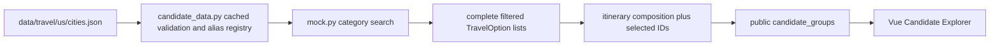

# US Candidate Data Implementation Report

## 1. Pre-implementation audit

The audit was completed before production changes and is preserved in `docs/testing/US_CANDIDATE_DATA_AUDIT.md`. Its 12 answers were:

1. Candidate data lived in four flat files under `data/mock/`; all search implementations and per-call JSON parsing lived in `backend/app/tools/mock.py`.
2. Only Boston and New York City were supported, with three attractions, three hotels, three restaurants, and three transport options per city (24 rows total).
3. NYC/New York aliases were duplicated between the requirements parser and mock search; no shared city registry existed.
4. Columbus failed because no Columbus fixture or alias existed. In addition, `zoos` was not routed to activity interests.
5. Every candidate had only `id`, `destination`, `name`, `price`, `unit`, and `tags`; `currency` came from a model default.
6. Candidate-level rating, review count, image, source, description, city/state, and category were absent. Only result-level source and candidate tags existed.
7. Search used case-folded destination equality, optional max-price filtering, strict AND tag matching, and `(price, id)` ordering.
8. The pre-tool planner received requirements and optional Wave 3 validation feedback, not candidate rows. The post-tool deterministic composer received every filtered candidate.
9. Alternatives remained in internal `tool_results` and public `execution.tools[].data`, but selected identity was lost when itinerary activities retained only name/category/cost.
10. The public response could serialize candidate lists but could not explicitly express selected versus alternatives.
11. The frontend tool cards displayed raw names and prices, but there was no decision-oriented Candidate Explorer.
12. The smallest clean path was one fixture-backed US registry, one cached loader, additive option metadata, explicit unsupported-city semantics, selected-ID preservation, a safe public candidate projection, and one compact frontend component.

Audit conditions: branch `main`, HEAD `08d922ed06e38cc53d803a056a1d3fab57c495a7`, with the pre-existing Wave 1–3 dirty working tree preserved.

## 2. Runtime parser consistency

The screenshot symptom was reproducible through the real `/api/v1/travel/plan` application path; it was not only stale frontend state.

- Before this implementation, `I like zoos and fried chicken` produced `zoos` as an `UNSPECIFIED` specific preference and correctly classified `fried chicken` as food. Consequently, the generic interests list showed only `food`, not `zoo`.
- The screenshot-like wording `I like viewing zoo and I love fried chicken` was parsed by the bounded preference regex as `viewing zoo` and `i love fried chicken`. Neither matched the small taxonomy, so the generic interest and food lists were empty even though raw specific values existed.
- This wave adds only the directly required normalization: `zoo`/`zoos` becomes the canonical `zoo` activity preference. The required Columbus sentence now routes `zoo` to attraction search and `fried chicken` to restaurant search.
- The repeated-introducer form (`... and I love ...`) remains a documented bounded-English limitation. A general parser rewrite or semantic ontology was intentionally not mixed into this data-layer wave.

## 3. Old data architecture

The old architecture was four independently loaded category files:

```text
data/mock/attractions.json  -> search_attractions
data/mock/hotels.json       -> search_hotels
data/mock/restaurants.json  -> search_restaurants
data/mock/transport.json    -> search_transport
```

Each search reparsed its file, owned destination filtering, and relied on a local two-alias dictionary. Adding one city required coordinated edits across four files. Unknown cities and supported cities with no tag match both appeared as generic `NO_RESULTS`. Those four migrated files were removed so they cannot remain a second source of truth.

## 4. New data architecture

The implementation uses one controlled dataset and one small generic loader:



`CandidateDataset`, `CityFixture`, and `CandidateFixture` validate shape, category completeness, unique candidate IDs, and non-conflicting aliases. `load_candidate_dataset()` is cached, so tools no longer parse JSON repeatedly. `candidates_for()` resolves aliases and performs the same generic operation for every city; there is no city-specific planner, graph, or search branch.

The live-evaluation provenance hash now includes `data/travel/us/*.json` instead of the retired `data/mock/*.json` files.

## 5. Supported US cities

| Canonical city | State | Representative aliases |
|---|---|---|
| Boston | MA | Boston, MA; Boston Massachusetts |
| New York City | NY | NYC; New York; New York, NY; New York City, NY |
| Columbus | OH | Columbus, OH; Columbus Ohio |
| Chicago | IL | Chicago, IL; Chicago Illinois |
| Washington DC | DC | Washington, DC; Washington D.C.; DC; District of Columbia |
| Miami | FL | Miami, FL; Miami Florida |
| Austin | TX | Austin, TX; Austin Texas |
| Denver | CO | Denver, CO; Denver Colorado |
| Seattle | WA | Seattle, WA; Seattle Washington |
| San Francisco | CA | San Francisco, CA; San Francisco California; SF |
| Los Angeles | CA | Los Angeles, CA; Los Angeles California; LA; L.A. |
| Las Vegas | NV | Las Vegas, NV; Las Vegas Nevada; Vegas |

## 6. Candidate counts per city

| City | Attractions | Hotels | Restaurants | Transport |
|---|---:|---:|---:|---:|
| Boston | 3 | 3 | 3 | 3 |
| New York City | 3 | 3 | 3 | 3 |
| Columbus | 5 | 4 | 6 | 3 |
| Chicago | 3 | 3 | 3 | 3 |
| Washington DC | 3 | 3 | 3 | 3 |
| Miami | 3 | 3 | 3 | 3 |
| Austin | 3 | 3 | 3 | 3 |
| Denver | 3 | 3 | 3 | 3 |
| Seattle | 3 | 3 | 3 | 3 |
| San Francisco | 3 | 3 | 3 | 3 |
| Los Angeles | 3 | 3 | 3 | 3 |
| Las Vegas | 3 | 3 | 3 | 3 |
| **Total** | **38** | **37** | **39** | **36** |

The dataset contains 150 candidates. Columbus deliberately has a larger pool so its three-day zoo/fried-chicken plan can use multiple matching candidates while still preserving two or three alternatives in every category. Other cities retain a compact three-per-category offline regression pool.

## 7. Candidate schema

The public `TravelOption` schema now supports:

| Field | Type / semantics |
|---|---|
| `id` | Stable candidate ID |
| `destination` | Canonical display destination |
| `city` | Canonical city; optional only for compatibility with injected legacy test/provider records |
| `state` | Two-letter state/district code; optional compatibility field |
| `category` | `attractions`, `hotel`, `food`, or `transport` |
| `name` | Candidate name |
| `price` | Non-negative numeric quote |
| `currency` | USD in this fixture |
| `unit` | Per-person visit/night/meal/day |
| `tags` | Controlled preference tags |
| `rating` | Optional 0–5 demo value |
| `review_count` | Optional non-negative demo value |
| `image_url` | Optional image metadata; null is valid |
| `source` | `controlled_mock_fixture` for this dataset |
| `description` | Optional short fixture description |
| `preference_matches` | Normalized requested tags matched by this result |

The fixture always supplies city, state, category context through the loader. Optional metadata remains nullable so incomplete controlled rows or future adapters do not crash serialization or the UI. Price remains one field paired with a typed quote unit; no redundant `price_per_night`, admission, or fare fields were introduced.

All candidate names are visibly prefixed `Mock`, and public source text says `Controlled mock fixture`. Ratings/review counts are not attributed to Google, Yelp, Booking.com, or any real provider.

## 8. City normalization

`location_key()` case-folds a destination, removes punctuation, and normalizes whitespace. Aliases live in the fixture and resolve to one `CityFixture`. This handles, among others:

- `NYC`, `New York`, and `New York City` → `New York City`
- `Washington DC`, `Washington D.C.`, and `Washington, DC` → `Washington DC`
- `Columbus`, `Columbus, OH`, and `Columbus Ohio` → `Columbus`

The requirements parser now consults this same registry for canonical display names and shorthand prefixes. A generic punctuation normalization handles dotted two-letter abbreviations and city/state commas before bounded parsing. Adding a conventional future city and its aliases requires fixture data, not a Python city map.

Destinations not in the controlled registry return `NO_RESULTS` at the tool contract with the allowlisted public error code `UNSUPPORTED_CITY_DATA`. The graph collapses four identical unsupported search failures into one top-level error and does not fabricate an itinerary.

## 9. Preference matching

Search remains deterministic and conservative:

1. resolve the city through the fixture registry;
2. apply optional maximum price;
3. normalize controlled preference terms (`zoos` → `zoo`);
4. require strict AND matching when preferences are supplied;
5. order matches by preference-match count, price, and stable ID.

Each returned candidate carries `preference_matches` for public explanation. A supported city with candidates but no row satisfying all requested tags returns ordinary `NO_RESULTS`, distinct from `UNSUPPORTED_CITY_DATA`. No fuzzy matching, embedding search, network call, or LLM ranking was added.

## 10. Candidate preservation

Search tools return all filtered matches, not just the first row. Those lists remain in `TravelState.tool_results` and `execution.tools[].data`.

`compose_draft()` now also records unique selected candidate IDs per category while it builds itinerary activities. The final allowlisted projection joins these IDs to the final tool results and creates one `CandidateGroup` per category:

- `selected`: every candidate actually used in the final itinerary;
- `alternatives`: every returned candidate not used.

Normal planning and Wave 3 budget repair use the same mechanism. After repair, public groups describe the final repaired selection. The first rejected draft is still represented through the typed validation/replan history, not duplicated as a second public candidate snapshot.

## 11. Public API changes

Changes are additive except for the more explicit unsupported-city result:

- `TravelOption` exposes the unified metadata listed above.
- `PublicExecutionSummary.candidate_groups` contains explicit selected and alternative lists.
- `PublicToolRecord.error_code` now allows `UNSUPPORTED_CITY_DATA` in addition to `tool_execution_failed`.
- Raw `ToolResult.error`, arbitrary metadata, planner internals, messages, credentials, and chain-of-thought remain excluded by the public projection.
- Existing `execution.tools[].data`, itinerary, budget, validation, and Wave 3 fields remain available.

Model-to-JSON-to-model tests cover the expanded option, tool-result, response, and candidate-group paths. Null rating, review count, and image fields serialize without failure.

## 12. Frontend Candidate Explorer changes

`CandidateExplorer.vue` was added to the existing `ResultsShell` flow without redesigning the page. For each available category it renders:

- selected or alternative badge;
- candidate name;
- price and quote unit;
- rating and demo review count when present, or an explicit not-supplied label;
- tags;
- preference matches;
- controlled mock source;
- an image only when `image_url` is present.

The component is display-only. Responsive styles reuse the existing neutral panel/card/tag system. It does not add booking, maps, live availability, new workflow state, or a dependency. SSR coverage verifies selected/alternative labels, metadata, null handling, source disclosure, and absence of an image element when no image exists.

## 13. Columbus acceptance case

Input:

```text
Plan a 3-day trip to Columbus. I like zoos and fried chicken.
```

Observed final result:

- Status: `success`
- Requirements: destination `Columbus`; duration `3`; interests `zoo`, `food`; food preference `fried chicken`; specific preferences `ACTIVITY:zoo` and `FOOD:fried chicken`
- Candidate retrieval: 5 zoo-tagged attractions, 4 hotels, 6 fried-chicken-tagged restaurants, 3 transport options; all four searches `SUCCESS`
- Selected attractions: Mock Zoo River Trail; Mock Discovery Animal Center; Mock Zoo Science Hall
- Attraction alternatives: 2
- Selected restaurants: Mock Buckeye Fried Chicken; Mock Capital Chicken Sandwich; Mock North Market Chicken
- Restaurant alternatives: 3
- Hotel: Mock Capital Budget Lodge; 3 alternatives preserved
- Transport: Mock Walking Allowance; 2 alternatives preserved
- Itinerary: all 3 days present
- Budget: USD 343.00 per-traveler reference because traveler count was not supplied; hotel 164, food 141, transport 0, attractions 38
- Validation: performed and `passed`, with no violations
- Source disclosure: every candidate is `controlled_mock_fixture`; no live provider was called

## 14. Regression

Final local verification:

| Check | Result |
|---|---|
| Backend full suite | PASS — 294 passed, 3 expected xfailed, 0 failed |
| Frontend full suite | PASS — 42 passed, 0 failed |
| TypeScript/Vue typecheck | PASS — `vue-tsc --noEmit` |
| Production build | PASS — Vite, 47 modules transformed |
| Ruff | PASS — all checks passed |
| Diff whitespace check | PASS — no whitespace errors; Git emitted only existing LF/CRLF conversion notices |

Focused regression evidence:

- Boston three-day request: success, validation passed.
- NYC three-day request: success, canonical destination `New York City`, validation passed.
- Wave 3 Boston two travelers / USD 400 hard total budget: one replan, repaired total USD 392, validation passed.
- The original strict multi-preference negative-control cases still return `NO_RESULTS`; their budget tool does not run.
- Fixture-only extension test appends a synthetic city to a temporary dataset and searches it successfully without modifying planner, graph, or city-specific Python logic.

No live API, scraping, provider SDK, network access, database, new dependency, or external account was used.

## 15. Remaining limitations

- Coverage is limited to the selected 12 U.S. cities in the controlled fixture.
- All candidates, prices, ratings, and review counts are mock/demo data.
- Data is not real-time and has no live inventory or availability.
- Review metadata does not come from a real review provider.
- Images are optional and are currently null; no external image provider is implied.
- There is no real map routing, travel-time calculation, geospatial feasibility, opening-hours validation, booking, tax/tip calculation, or intercity fare lookup.
- Preference matching is exact, strict AND matching over a small controlled vocabulary; it is not semantic search.
- The bounded parser now handles the required `zoos and fried chicken` sentence but does not generally split repeated preference introducers such as `and I love ...`.
- The pre-tool planner chooses tool requests; deterministic itinerary composition chooses candidates from the returned pools. No LLM/provider candidate ranking was introduced.
- Public candidate groups describe the final selection after any Wave 3 repair, not a complete before/after candidate-selection history.
