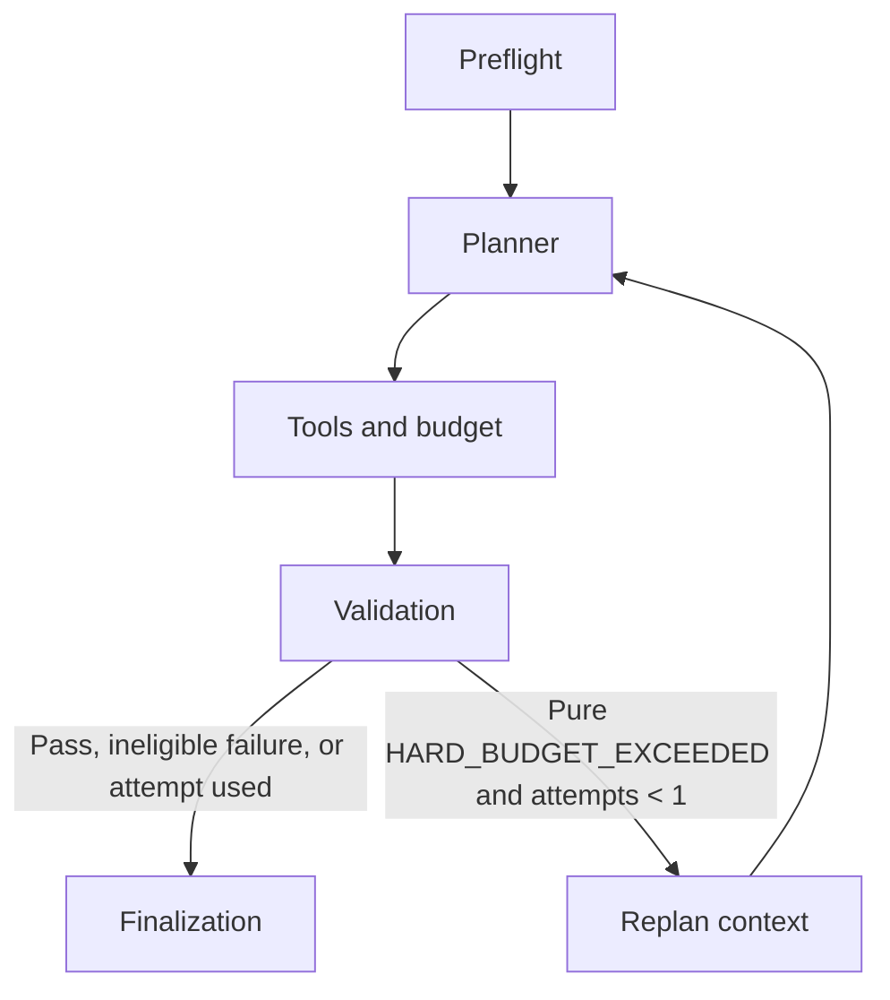

# Wave 3 — Structured Validation Feedback & Bounded Automatic Replan

## 1. Objective

Wave 3 implements one deterministic recovery path: typed validation feedback leads to at most one budget-aware replan, followed by mandatory revalidation. It does not implement generic retry or repair.

## 2. Repository Baseline

| Item | Before Wave 3 |
|---|---|
| Branch | `main` |
| HEAD | `08d922ed06e38cc53d803a056a1d3fab57c495a7` |
| Working tree | Already dirty with known Wave 1/2 tracked changes and prior scenario/audit/documentation files |
| Targeted baseline | 117 passed, 4 xfailed, 0 failed |
| Backend baseline | 269 passed, 4 xfailed, 0 failed |

Wave 3 modifications were layered on top of that uncommitted work. No known Wave 1/2 modification was overwritten, reset, stashed, or committed.

## 3. Remaining XFAIL Inventory

| Test | Classification | Wave 3 result |
|---|---|---|
| `test_rejects_geographically_impossible_daily_schedule` | Geographic/data gap | Remains XFAIL |
| `test_validation_failure_triggers_a_second_planner_attempt` | Wave 3 validation feedback/replan | Converted to PASS |
| `test_multiturn_revision_preserves_unchanged_days` | Multi-turn/deferred | Remains XFAIL |
| `test_attraction_only_request_selects_no_unneeded_trip_tools` | Request-mode/deferred | Remains XFAIL |

## 4. Pre-Wave Graph

```text
preflight -> planner -> tools -> validation -> finalization
```

`validate_itinerary` returned a typed violation, but its graph node placed the failure in `errors` and unconditionally continued to finalization. There was no replan state, feedback object, counter, or conditional validation route.

## 5. Post-Wave Graph



The success-first path is unchanged. The only loop has a state guard and a terminal branch.

## 6. Replan Eligibility Policy

`is_replan_eligible(validation, errors)` returns true only when all of the following hold:

- validation was performed and failed;
- one or more typed violations exist;
- every violation code is `HARD_BUDGET_EXCEEDED`; and
- the error list consists solely of those violation messages.

Tool errors, missing artifacts, structural failures, unknown codes, soft preferences, and objectives therefore do not enter replan.

## 7. Bounded Retry Policy

`MAX_REPLAN_ATTEMPTS = 1`. The first plan is not a replan. An eligible first validation failure creates attempt 1; the second validation always routes to finalization, whether it passes or fails. There is no third planner call.

## 8. Structured Feedback Contract

`ReplanContext` is a typed Pydantic model passed directly to the planner as its optional `feedback` argument:

```text
violations: [code, category, expected, actual, excess, message]
previous_itinerary: typed itinerary snapshot
attempt: 1
```

The deterministic planner uses non-null feedback to set its explicit `budget_repair` decision. The OpenAI adapter also accepts the same typed feedback and serializes a structured `requirements` plus `replan_context` input when invoked; no provider call was made during this work.

## 9. State Changes

`TravelState` adds only the fields needed for the loop:

- `replan_attempts: int`
- `replan_context: ReplanContext | None`
- `budget_repair: bool`

Preflight resets all three per request. The public execution summary additively exposes `replan_attempts` (zero or one), while the final validation still exposes the typed violation if bounded repair fails.

## 10. Planner / Repair Changes

Search results are already stably sorted by `(price, id)`. The initial plan keeps its existing day-by-day rotating candidate selection. When the planner explicitly marks a feedback-driven repair, `compose_draft` instead selects the lowest-cost existing matching attraction and restaurant for each day. Hotel and transport were already lowest-cost selections.

This changes actual itinerary activities and rebuilds `BudgetInput`; the existing calculator then recomputes cost. It does not modify a total, invent a fixture, lower user requirements, or downgrade `HARD` to `SOFT`.

## 11. Graph Changes

The new `replan` graph node snapshots the failed itinerary and typed violations, clears only the previous semantic error, increments the counter, and returns to the existing planner node. The existing tools and validation nodes execute again. A planner that receives feedback but does not explicitly set `budget_repair` terminates with `planner_did_not_apply_budget_repair` rather than blindly repeating a plan.

## 12. Successful Repair Scenario

For `Plan a 2-day trip to Boston for 2 travelers under $400 total.`:

| Step | Result |
|---|---|
| Initial itinerary | Total 446; `HARD_BUDGET_EXCEEDED` (`expected=400`, `actual=446`, `excess=46`) |
| Feedback | Violation plus the typed 446-cost itinerary and `attempt=1` |
| Repaired itinerary | Existing day-two candidates change from the rotated museum/restaurant to the lowest-cost park/Garden Cafe choices |
| Recomputed total | 392 |
| Second validation | PASS |
| Final response | Success, `replan_attempts=1`, repaired itinerary and budget |

## 13. Unrecoverable Scenario

For the same trip with a `$50 total` hard limit:

```text
Initial total 446 -> typed failure -> one repair -> recomputed total 392
-> typed failure -> terminal error
```

The response records `replan_attempts=1`, retains the final `HARD_BUDGET_EXCEEDED` context (`actual=392`), and has exactly two planner and two validation stages.

## 14. Tests Added / Modified

| File | Coverage |
|---|---|
| `backend/tests/agent/test_replan.py` | Feedback propagation, material itinerary change, recomputed cost, revalidation count, bounded terminal failure, pass-first/soft/objective/tool/non-eligible paths, and request isolation |
| `backend/tests/agent/test_scenario_semantics.py` | Genuine conversion of the replan XFAIL with a feasible hard-budget repair |
| `backend/tests/agent/test_public_execution.py` | Public stage/count contract and repaired final hard-budget context |
| Existing frontend execution files | Type and pipeline support for the additive replan stage |

## 15. XFAIL Conversion

| Metric | Result |
|---|---:|
| Before Wave 3 | 4 xfailed |
| Wave 3 XFAIL identified | 1 |
| Converted to PASS | 1 |
| Remaining | 3 xfailed |
| XPASS | 0 |

## 16. Regression

```text
Targeted replan/scenario: 38 passed, 3 xfailed
Backend:                 276 passed, 3 xfailed, 0 failed
Frontend:                41 passed
Typecheck:               passed
Build:                   passed
Ruff:                    passed
```

The backend retains the existing Starlette/AnyIO deprecation warning only.

## 17. Scope Compliance

| Boundary | Implemented? |
|---|---:|
| Tool recovery | NO |
| Geographic feasibility | NO |
| Multi-turn | NO |
| Optimization objective execution | NO |
| External API | NO |
| Generic retry framework | NO |
| Multi-agent architecture | NO |
| Planner rewrite | NO |

## 18. Failure Safety

- The loop guard is reset during preflight and is request-local.
- Only a pure typed semantic hard-budget failure is eligible.
- Tool failures and non-eligible validation failures are terminal without a planner retry.
- A second semantic failure terminates; tests assert two, not three, planner/validation attempts.
- A repair must be an explicit planner decision; the graph rejects a feedback call that does not mark `budget_repair`.

## 19. Remaining Capability Gaps

- No repair when even the least-cost matching fixture plan exceeds the hard budget.
- No tool fallback, partial result, or provider retry policy.
- No geographic/time validation or route repair.
- No persistent multi-turn itinerary revision.
- No attraction-only request mode.
- No preference fulfillment or objective-quality evaluation.

## 20. Recruiter Demo Impact

| Before | After |
|---|---|
| A hard-budget violation was detected and stopped the request. | A typed hard-budget violation can trigger one feedback-driven, budget-relevant repair attempt. |
| No planner received failure context. | The planner receives typed violation data and the previous itinerary. |
| No repair verification existed. | The repaired itinerary is budget-recomputed and validated again; success or safe terminal failure follows. |
